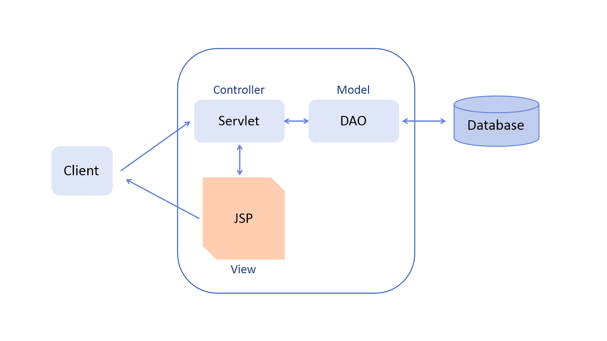

# MVC

## MVC란 ?
MVC는 Model-View-Controller의 약자이다.일반 PC 프로그램 개발에 사용되는 디자인 패턴을 웹 애플리케이션에 도입한 것이다. 웹 애플리케이션을 화면 부분, 요청 처리 부분, 로직 처리 부분으로 나누어 개발하는 방법이다. 모델2 방식의 구조가 MVC를 포함하는 개념이지만 MVC가 모델2 방식의 뼈대를 이루므로 모델2 방식으로 구현한다는 말은 곧 MVC로 구현한다는 것과 같은 의미로 본다.

---
## MVC의 특징
- 각 기능이 분리되어 있어 개발 및 유지보수가 편리하다.
- 각 기능의 재사용성이 높아진다.
- 디자이너와 개발자의 작업을 분업화해서 쉽게 개발할 수 있다.

---
## MVC 디자인 패턴

## Controller
- 사용자의 요청 및 흐름 제어를 담당한다. 

## Model
- 비즈니스 로직을 처리한다.

## View
- 사용자에게 보여줄 화면을 담당한다.
