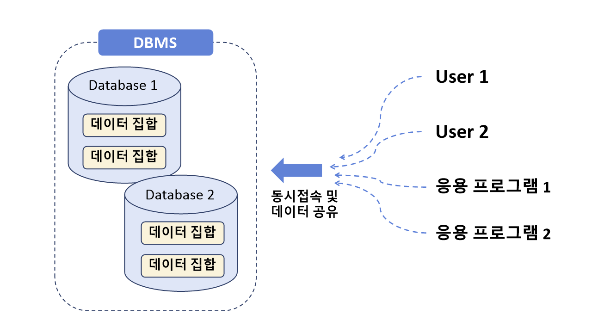

# 1. DBMS와 SQL

### 1. 데이터베이스 (Database) 

- "의미있고 연관된" 데이터 모음 집합체, 데이터의 저장공간

###  2. DBMS(Database Management System) 

- 데이터베이스를 관리 및 운영하는 역할
- 메모장, 엑셀과 같은 이전 파일시스템의 단점을 보완 (ex) 사용 데이터 양이 많아지면 데이터 중복 문제)
- 대용량 데이터를 효율적으로 관리
- 여러 명의 사용자가 공유

### 2-1. 관계형 DBMS (Relational DBMS)

- 데이터를 행과 열의 테이블(Table)로 구조 표현
- 관계형 DB 언어(=SQL) 사용

1. `사용자 생성`
2. `새로운 DB 생성`
3. `새로운 테이블 생성`
4. `테이블에 데이터 저장, 수정 삭제, 조회`

### 2-2. DB/DBMS 특징

- 데이터 무결성

- 데이터 독립성

- 보안

- 데이터 중복의 최소화

- 응용 프로그램 제작 및 수정이 쉬워짐

- 데이터 안정성 향상

  

### 3. SQL

- 관계형 데이터베이스에서 사용되는 언어

- 분산형 클라이언트/서버 구조

- 대화식 언어

- DBMS 제작 회사와 독립적

- 다른 시스템으로 이식성이 좋음

- 표준이 계속 발전

  

### 4. MySQL

- Oracle사에서 제작한 DBMS 소프트웨어

- 오픈소스로 제공

- `MySQL Server 8.0` : 관계형 데이터베이스(테이블) 모음
- `MySQL Workbench 8.0` : SQL작성 (실행 툴)

  