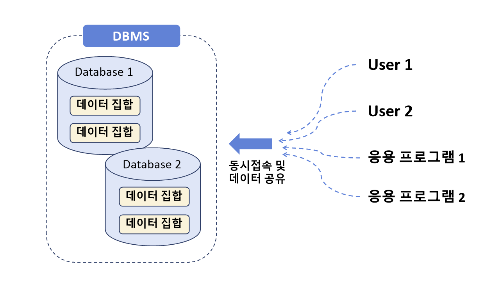

# DAY 01

 

:milky_way:  **목차**  

- [DBMS와 SQL](#dbms와-sql)
- [SQL의 분류](#sql의-분류)
- [SELECT문](#select문)
 
 

:milky_way:  **예제**  
- [SELECT문(FROM, WHERE, ORDER BY)](./select.sql)

 

---

## DBMS와 SQL

#### 1. 데이터베이스 (Database)

- "의미있고 연관된" 데이터 모음 집합체, 데이터의 저장공간

 

#### 2. DBMS (Database Management System)

- 데이터베이스를 관리 및 운영하는 역할
- 메모장, 엑셀과 같은 이전 파일시스템의 단점을 보완 (ex) 사용 데이터 양이 많아지면 데이터 중복 문제)
- 대용량 데이터를 효율적으로 관리
- 여러 명의 사용자가 공유

#### 2-1. 관계형 DBMS (Relational DBMS)

- 데이터를 행과 열의 테이블(Table)로 구조 표현
- 관계형 DB 언어(=SQL) 사용

1. `사용자 생성`
2. `새로운 DB 생성`
3. `새로운 테이블 생성`
4. `테이블에 데이터 저장, 수정, 삭제, 조회`

 

#### 2-2. DB/DBMS 특징

- 데이터 무결성
- 데이터 독립성
- 보안
- 데이터 중복의 최소화
- 응용 프로그램 제작 및 수정이 쉬워짐
- 데이터 안정성 향상

 

#### 3. SQL

- 관계형 데이터베이스에서 사용되는 언어

- 분산형 클라이언트/서버 구조

- 대화식 언어

- DBMS 제작 회사와 독립적

- 다른 시스템으로 이식성이 좋음

- 표준이 계속 발전

   

#### 4. MySQL

- Oracle사에서 제작한 DBMS 소프트웨어
- 오픈소스로 제공
- `MySQL Server 8.0` : 관계형 데이터베이스(테이블) 모음
- `MySQL Workbench 8.0` : SQL작성 (실행 툴)

 
 
---

# SQL의 분류

#### 1. DDL (Data Definition Language)

- 데이터 정의 언어

- 트랜잭션을 발생시키지 X

- 데이터베이스, 테이블, 뷰, 인덱스 등의 데이터베이스 개체를 생성, 삭제, 변경

  - `CREATE` : 생성

  - `DROP` : 삭제

  - `ALTER` : 변경

     

#### 2. DML (Data Manipulation Language)

- 데이터 조작 언어

- 데이터를 추가, 삭제, 수정하는 등의 역할

  - `INSERT` : 추가

  - `DELETE` : 삭제

  - `UPDATE` : 수정

  - `SELECT` (DQL로 구분하기도 한다.)

  - 트랜잭션이 발생하는 SQL

    - **트랜잭션(Transaction)이란?**

      테이블의 데이터를 변경(ex) 삭제, 수정)할 때 실제 테이블에 완전히 적용하지 않고,

      임시로 적용시키는 것 (실수해도 취소 o)

       

#### 3. DQL (Data Query Language)

- 데이터 질의 언어

- 일부에서는 DML에서 `SELECT`만을 따로 분리해서 DQL이나 간단히 QUERY로 표현하기도 한다.

  - `SELECT` : 선택 / 조회

     

#### 4. DCL (Data Control Language)

- 데이터 제어 언어

- 데이터의 보안, 무결성, 회복, 병행 수행제어 등을 정의하는데 사용한다.

- 관리자(root 계정)만 사용 가능

  - `GRANT` : 사용자에게 권한 부여
  - `REVOKE` : 사용자 권한 회수
  - `COMMIT` (TCL로 구분하기도 한다.)
  - `ROLLBACK` (TCL로 구분하기도 한다.)

   

#### 5. TCL (Transaction Control Language)

- 일부에서는 DCL에서 트랜잭션을 제어하는 명령어인 `COMMIT`과 `ROLLBACK` 만을 따로 분리해서 TCL이라고 표현하기도 한다.
  - `COMMIT` : 트랜잭션의 작업 결과를 반영
  - `ROLLBACK` : 트랜잭션의 작업 취소 및 원래대로 복구

 
 

---

# SELECT문

- 조회 (DQL) - Query language
- 가장 많이 사용하는 구문
- 데이터베이스 내의 테이블에서 원하는 정보를 추출하는 명령
- `SELECT` 컬럼(열)명 (함수, 연산자, 컬럼 별명 o)
  - `FROM` 
  - `WHERE` : (`컬럼명` `연산자` `값`) : T/F
  - `GROUP BY`
  - `HAVING`
  - `ORDER BY` 

 

- 산술연산 : `+`, `-`, `*`, `/`
- 비교연산 : `>`, `>=`, `<`, `<=`, `=`, `!=`
- 논리적 결합 연산 : `or`, `and`, `not`
- 유사 패턴 비교 : `like` , `%`, `_`
- 목록 : `in()`
- 범위 : `between` `and` 
  - 숫자 : 작은 => 큰
  - 날짜 : 오래된 => 최근
  - 문자 : 사전 앞 => 사전 뒤
  - 숫자 - 대문자 - 소문자 - ... - 한글 순
- null 값 비교 : `is`, `is not`