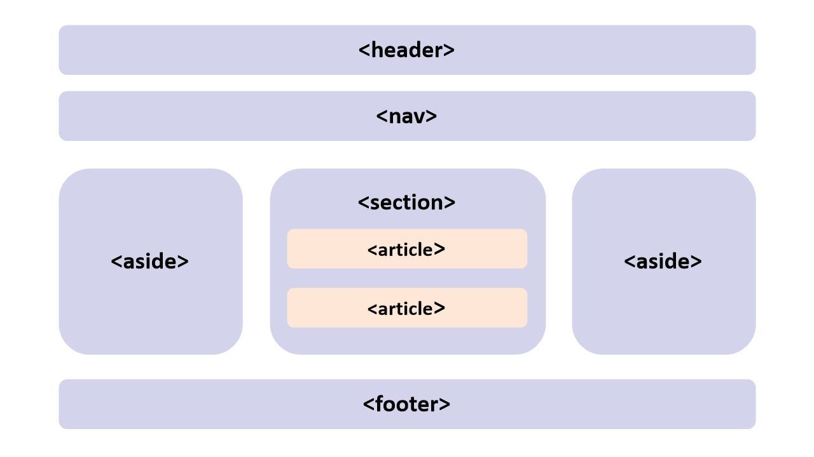

# HTML5 기본 태그와 문서 구조화

<br>

:milky_way: **예제**
- [test 모음](./test)

<br>

---

# 기본 태그

## 입력 양식 종류

- `form` : 입력 양식의 시작과 끝 표시
- `<form action=”전송 위치” method=”전송 방식”>`
  - `input`
    - text, button, checkbox, file, hidden, image, password,  radio, reset, submit
  - `textarea`
    - cols/rows
  - `select`  `option`
  - `fieldset` `legend`

## HTML 추가 태그

- 모든 브라우저에서 동일하게 동작하는 것은 아직 불완전하다. 
- 브라우저 종류마다 다르게 보일 수 있다.

```html
<form action="html5.jsp">
		색상선택 : <input type="color" name="co"><br> 
		날짜선택 : <input type=date name="da"><br> 
		이메일 : <input type="email" name="em"><br> 
		홈페이지 : <input type="url" name="ur"><br>
		폰번호 : <input type="tel" neme="te"><br> 
		숫자 : <input type="number" name="na"><br> 
		범위 : <input type="range" name="ra"><br>
		<input type=submit value="전송">
	</form>
```

---

# HTML 문서 구조화

## 공간 분할 태그

- `div` : block level element
- `span`  : inline level element

## 시멘틱 태그
