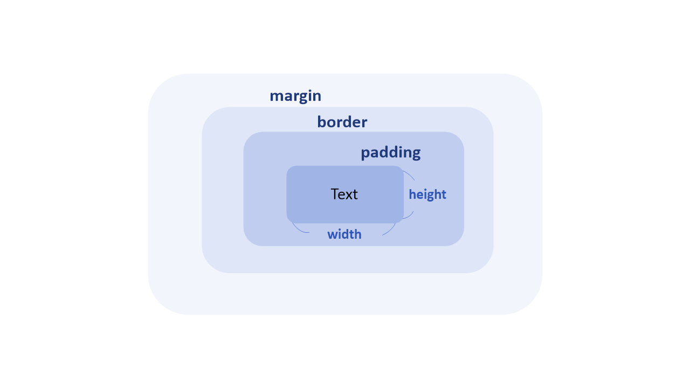

# CSS3 (Cascading Style Sheets) 선택자와 속성


# CSS 선택자
## CSS란 ?

마크업 언어가 실제 표시되는 방법을 기술하는 스타일 언어이다. HTML과 XHTML에 주로 쓰이며, XML에서도 사용할 수 있다 W3C의 표준이며, 레이아웃과 스타일을 정의할 때의 자유도가 높다.

## 선택자의 용도와 사용법

- CSS3에서 특정 HTML 태그를 선택할 때는 선택자를 사용
- `선택자 {스타일 속성 : 스타일 값;}`

```css
// h1 태그의 color 스타일 속성에 스타일 값으로 red를 적용한다.
h1 { color : red; }
```

CSS3 선택자는 스타일시트뿐만 아니라 자바스크립트에서도 사용한다.

CSS 우선순위

1. inline CSS
2. <style> 태그
3. CSS 파일 : `<link href=”a.css” rel=”stylesheet”>` 로 연결

## 기본 선택자

- `전체 선택자 (*)`
- `태그 선택자 (태그)`
- `아이디 선택자 (#아이디)`
- `클래스 선택자 (.클래스)`

## 속성 선택자

- `선택자[속성]`
- `선택자[속성 = 값]`

## 후손 선택자와 자손 선택자

- `선택자A 선택자B` : 선택자A의 후손인 선택자B 선택
- `선택자A > 선택자B` : 선택자A의 자손인 선택자B 선택

## 구조 선택자

- `선택자:first-child`
- `선택자:last-child`
- `선택자:nth-child(수열)`
- `선택자:nth-last-child(수열)`

## 링크 선택자

- `선택자:link`
- `선택자:visited`

## 반응 선택자

- `선택자:hover`
- `선택자:active`

## 상태 선택자

- `선택자:checked`
- `선택자:focus`
- `선택자:enabled`
- `선택자:disableld`

## CSS3 단위

스타일 값으로 입력할 수 있는 단위에는 키워드, 크기, 색상, URL이 있다.

ex) `inline`, `block`, `flexbox`,`%`, `px`, `green` 등이 있다.

---
# CSS 속성

## 1. 박스 속성


## 2. 가시 속성
- ex) `display`

## 3. 배경 속성
- ex) `background-image`, `background-size`, `background-position`

## 4. 글자 속성
- ex) `font-size`,  `font-weight`, `font-style`, `text-align` 