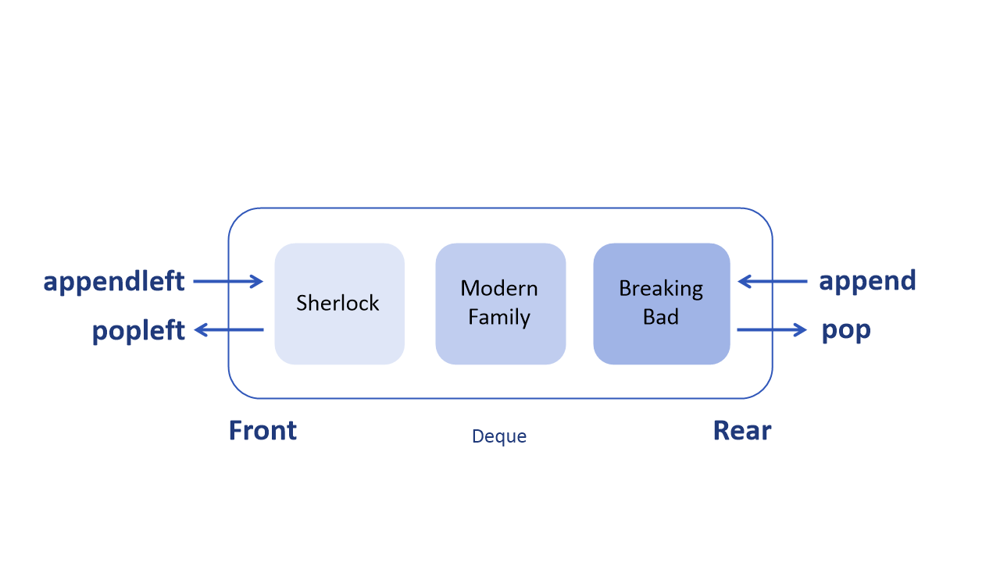

# 덱 (Deque)
## 덱 (Deque) 이란 ?
양쪽에서 삽입과 삭제가 가능한 자료구조이며 스택과 큐의 연산을 모두 지원한다. 
덱은 double-ended queue를 줄여서 표현한 것으로, 양방향으로 넣고 뺄 수 있다는 사실에 초점이 맞추어져 지어진 이름이다.
덱은 스택과 큐의 특성을 모두 갖는, 둘을 조합한 형태의 선형 자료구조로 이해되고 있다.



- appendleft : 왼쪽에서(앞에서) 데이터를 삽입
- append : 오른쪽에서(뒤에서) 데이터를 삽입
- popleft : 왼쪽에서 데이터를 꺼내기(삭제)
- pop : 오른쪽에서 데이터를 꺼내기(삭제)

## 덱의 분류
- Scroll : 입력 제한 덱 (Input restricted deque) - 입력은 한쪽에서만 발생, 출력은 양쪽에서 발생
- Shelf : 출력 제한 덱 (Output restricted deque) - 입력은 양쪽에서 발생, 출력은 한쪽에서만 발생


## 덱의 사용
덱은 자주 쓰이지 않는다.

주로 앞, 뒤 모두에서 삽입, 삭제가 이루어질 때 사용한다.

데이터가 가변적일 때 사용한다.

- 보통 스케줄링에 사용
- 우선순위 조절 시 사용


## Java class ‘Deque’
```java
// Deque 선언, ArrayDeque 사용
Deque<E> deque = new ArrayDeque<>();

// First : 왼쪽, Last : 오른쪽

// 값 추가 (push) 
deque.offerFirst(추가할 값); //정상적으로 삽입 시 true, 용량 제한 시 false
deque.offerLast(추가할 값); 

deque.addFirst(추가할 값); // 용량 제한 시 예외(Exception) 발생 //push()와 동일
deque.addLast(추가할 값); //add()와 동일

// 값 꺼내기 (pop)
deque.pollFirst(); // 덱이 비어있으면 null // poll()과 동일
deque.pollLast();

deque.removeFirst(); // 덱이 비어있으면 예외 발생 // remove(), pop()과 동일 
deque.removeLast();

// 맨 앞과 맨 뒤의 값 출력
deque.peekFirst(); // 덱이 비어있으면 null //peek()와 동일
deque.peekLast();

deque.getFirst(); // 덱이 비어있으면 예외 발생
deque.getLast();

// 크기 구하기
deque.size();

// 비어있는지 확인 후 boolean 타입으로 반환
deque.isEmpty();

// 검색 후 삭제
deque.removeFirstOccurrence(제거할 값); // 왼쪽(앞)에서부터 탐색
deque.remove(제거할 값); // first와 동일
deque.removeLastOccurrence(제거할 값); // 오른쪽(뒤)에서부터 탐색

// 값이 있는지 확인
deque.contain(확인할 값);

// 순회 (Iterator)
deque.iterator(); // iterator로 변환
deque.descendingIterator(); // 역순 iterator 변환
```

## 장단점
#### 장점 
- 크기가 가변적이다.
- 데이터 삽입, 삭제가 빠르다.
- 원하는 데이터에 바로 접근이 가능하다.
#### 단점
- 구현이 어렵다.
- 중간 데이터의 삽입, 삭제가 어렵다.


## 시간 복잡도 (Time complexity)
- Insertion O(1)
- Deletion O(1)
- Search O(1)