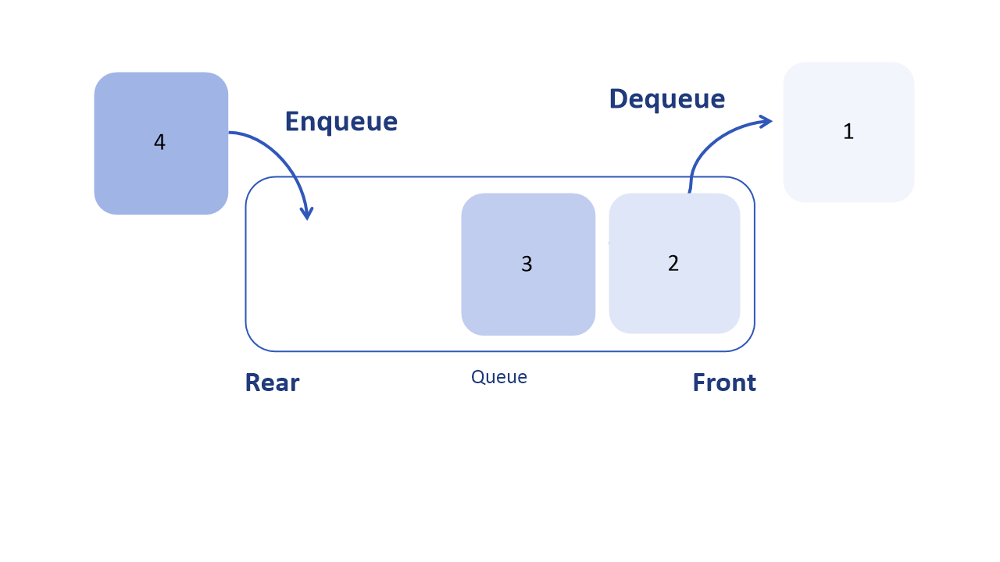
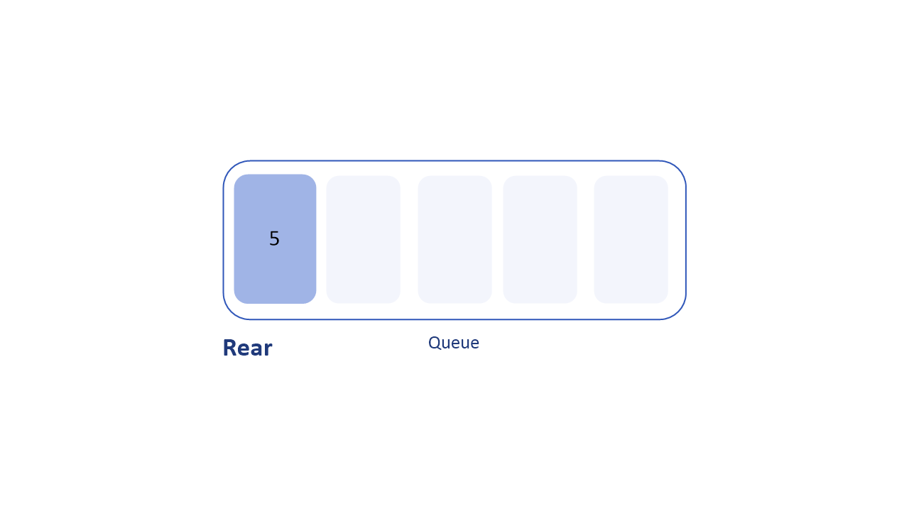
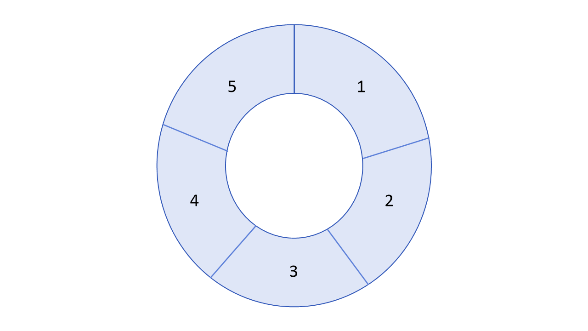

# 큐 (Queue)

## 큐 (Queue) 란?

큐는 스택과 함께 가장 많이 볼 수 있는 선형 자료구조이다. 스택과 반대로 선입선출이다. 즉, FIFO(First in First Out) 혹은 LILO(Last In Last Out)구조이다.  Queue는 사전적으로 ‘줄을 서서 기다리다’라는 의미를 가진다. 매표소에서 먼저 줄을 선 사람이 먼저 표를 사는 것과 같은 논리이다. 큐의 데이터는 맨 뒤로만 들어와서 맨 앞으로만 나갈 수 있다.



- Enqueue : 큐 맨 뒤에 데이터 추가
- Dequeue : 큐 맨 앞의 데이터 삭제
- peek :  front에 위치한 데이터 조회
- front : 큐 맨 앞의 위치(인덱스)
- rear : 큐 맨 뒤의 위치(인덱스)

## 큐의 사용

데이터가 입력된 시간 순서대로 처리해야 할 필요가 있는 상황에 사용한다. 보통 컴퓨터 버퍼에서 주로 사용한다. 여러 개가 한꺼번에 입력이 들어올 때 대기열을 만들어 순차적으로 처리하는 것이다. 다음은 큐를 사용하는 사례이다.

- 프린트 출력 처리
- 프로세스 관리
- CPU 스케줄링, 디스크 스케줄링
- 그래프의 넓이 우선 탐색 (BFS)에서 사용
- 서로 다른 스레드 혹은 프로세스 사이에서 자료를 주고 받을 때 자료를 일시적으로 저장 (비동기 전송) (ex) IO 버퍼)

## Overflow와 Underflow

- Queue Overflow : 가득 찬 큐에 데이터를 추가하려고 할 때
- Queue Underflow : 빈 큐에서 데이터를 삭제하려고 할 때

## Java class ‘Queue’

```java
// Queue 선언, Linkedlist 사용
Queue<E> queue = new LinkedList<>();

// 값 추가
queue.add(추가할 값); // 삽입 성공 시 true, 여유 공간이 없어 삽입 실패 시 IllegalStateException 발생
queue.offer(추가할 값);

// 값 꺼내기 (삭제)
queue.poll(); // 맨 앞의 값 반환 후 제거, 큐가 비어있으면 null 반환
queue.remove(); // 맨 앞의 값 제거
queue.clear(); // 초기화

// 맨 앞의 값 출력
queue.peek();

// 모든 값 출력 (Iterator 클래스 사용)
Iterater iter = queue.iterator();
while (iter.hasNext()) {
	System.out.println(iter.next());
}

// 크기 구하기
queue.size();

```

## 큐 구현 방법

스택과 마찬가지로 배열 혹은 연결리스트를 이용하여 구현할 수 있다. 

## Queue 종류

### 선형 큐(Linear Queue)

기본적인 큐의 형태로써 막대 모양으로 된 큐이다. 

선형 큐에서 삽입(Enqueue), 삭제(Dequeue)를 계속 반복하다 보면 Rear가 맨 마지막 인덱스 ‘5’를 가리키고, 앞에는 비어 있을 수 있지만 꽉 찼다고 인식한다. 이는 데이터 삭제 시 한 칸 앞으로 이동하지 않기 때문이다.



- 선형 큐 문제점
    - 배열 구현 시 크기가 제한되어 있다.
    - 빈 공간을 사용하려면 모든 자료를 꺼내거나 자료를 한 칸씩 옮겨야 한다. (지연시간 발생)
    - Enqueue, Dequeue 작업이 계속적으로 일어나면 큐가 비어있어도 데이터 추가가 불가능하다. (Overflow 발생)
    

### 원형 큐 (Circular Queue)

선형 큐의 문제점을 보완한 것이다. 원형 큐는 1차원 배열 형태의 큐를 원형으로 구성하여 배열의 처음과 끝을 연결한다. 환형 큐라고도 한다. 데이터 추가 시 Rear가 한 칸 움직이고, 데이터 삭제 시 Front가 한 칸 움직인다.



## 시간 복잡도 ****(Time complexity)****

- Insertion O(1)
- Deletion O(1)
- Search O(n)