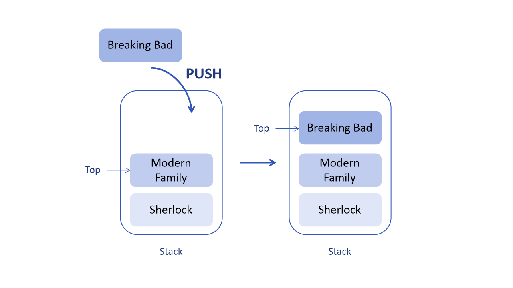
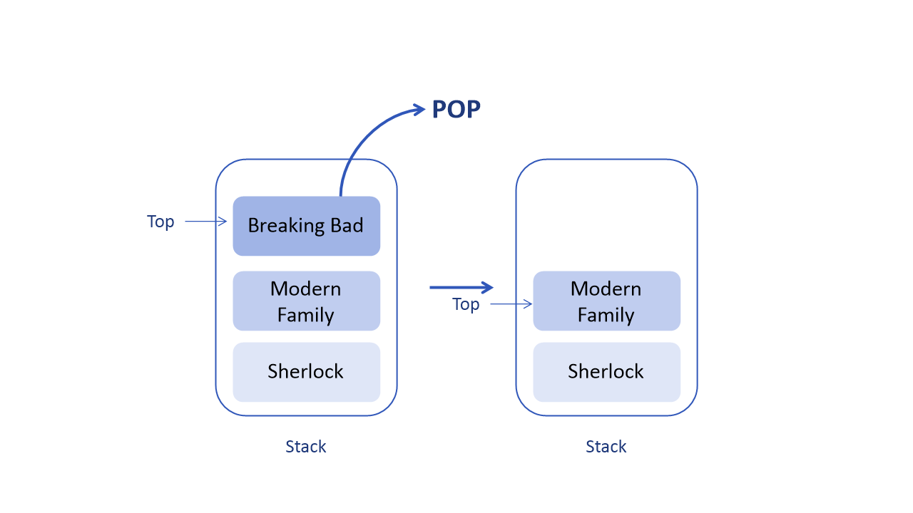

# 스택 (Stack)

## 스택 (Stack) 이란 ?

물건을 쌓아 올리듯이 데이터를 쌓는 자료구조로, 한 쪽 끝에서만 자료를 넣거나 뺄 수 있는 선형 자료구조(Linear Data Structur)이다. 

‘Pushdown list’라 부르기도 한다.

자료를 넣는 것을 Push 라고 하고, 꺼내는 것을 Pop 이라고 한다.

꺼내지는 자료는 가장 최근에 Push한 자료부터 나오게 된다.

평소에 사용하는 ‘뒤로가기’를 생각하면 이해가 쉽다.

뒤로가기를 누르면 가장 최근에 방문한 사이트를 보여주는 것 말이다.

제일 마지막에 넣은 값이 먼저 나오는 것을 LIFO(Last in First out) 혹은 FILO(First in Last  out)구조라고 한다.

## Push

데이터를 스택에 넣는다.



step 1 : 스택이 가득 찼는지 확인

step 2 : 스택이 가득 차면 오류 발생하고 종료

step 3 : 스택이 가득 차지 않으면 Top 증가

step 4 : Top이 가리키는 스택 위치에 데이터 추가
<br>
<br>

## Pop

데이터를 스택에서 꺼내온다. 즉, 제거한다.



step 1 : 스택이 비어 있는지 확인

step 2 : 스택이 비어 있으면 오류 발생하고 종료

step 3 : 스택이 비어 있지 않으면 Top이 가리키는 데이터 제거

step 4 : Top 값 감소

step 5 : 성공을 반환
<br>
<br>

## 스택의 사용

스택은 직전의 데이터를 빠르게 가져올 수 있다.

균형성 검사를 할 수 있기 때문에 수식, 괄호 등의 검사에서도 쓰인다.

다음은 스택을 사용하는 사례이다.

- 자바 Stack 메모리
- 재귀 알고리즘
- Backtracking
- 웹 브라우저 방문 기록, 뒤로 가기
- 실행 취소 (undo)
- 역순 문자열 만들기
- 그래프의 깊이 우선 탐색 (DFS)

## Overflow와 Underflow

 `Stack Overflow` : 스택이 완전히 꽉 찼을 때 

 `Stack Underflow` : 스택이 완전히 비어 있을 때 

## Java class ‘Stack’

```java
// Stack 선언
Stack<E> stack = new Stack();

// 값 추가
stack.push(추가할 값);

// 값 꺼내기 (삭제)
stack.pop();

// 전체 값 삭제 (초기화)
stack.clear(); 

// 가장 상단의 값 출력
stack.peek();

// 비어있는지 check (비어있으면 true)
stack.empty();

// 1이 있는지 check (있으면 true)
stack.contains(1);
```

## 스택 구현 방법

1. 배열 사용
    - 장점 : 구현하기 쉽다.
    - 단점 : 크기가 동적이 아니다. 런타임 시 필요에 따라 늘어나거나 줄어들지 않는다.
2. 연결 리스트 사용
    - 장점 : 크기가 동적이다. 필요에 따라 크기가 확장되거나 축소될 수 있다.
    - 단점 : 포인터를 위한 추가 메모리 공간이 필요하다.
    

## 시간 복잡도 (Time complexity)

- Insertion O(1)
- Deletion O(1)
- Search O(n)

삽입(push), 삭제(pop)는 항상 Top에서만 일어나기 때문에 O(1) 시간이 걸린다. 

하지만 특정 데이터를 찾을 때에는 특정 데이터를 찾을 때까지 수행하기 때문에 O(n)이다.