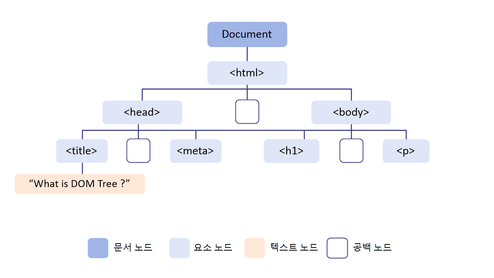

# 문서 제어 (DOM 객체)


<br>

:milky_way: **예제**
- [DOM 객체 예제1](./test/dom1.html)
- [DOM 객체 예제2](./test/dom2.html)

:milky_way: **책 범위**
- 교재 14장

<br>


---

## DOM (Document Object Model) 트리

- 512 ~ 513p
- DOM (문서 객체 모델) : XML이나 HTML 문서에 접근하기 위한 일종의 인터페이스
- DOM Tree : 브라우저가 HTML 문서를 로드한 후 파싱하여 생성하는 모델 (객체의 트리로 구조화)
- 노드 (Node) : DOM 트리를 구성하는 객체 하나
    
    
    

- 문서 노드 : 전체 문서를 가리키는 Document 객체 (= DOM 트리의 루트)
- HTML 요소 노드 : HTML 요소를 가리키는 객체
- 텍스트 노드 : 텍스트를 가리키는 객체
- 공백 노드 : 공백 문자 만으로 구성된 텍스트 노드

<br>
<br>

### 노드 객체의 프로퍼티

노드도 부모 노드, 자식 노드, 형제 노드, 조상 노드가 있다. 

`firstChild`, `childNodes` 와 같은 노드 객체의 프로퍼티를 활용하여 노드 객체를  가져올 수도 있다. 

하지만, Document 객체에는 더욱 편리하게 요소 객체를 가져올 수 있는 메서드가 있다.  

---

## 노드 객체 가져오기

- 518 ~ 527p

1. id 속성으로 노드 가져오기

```jsx
document.getElementById(id 값);
```

2. 요소의 이름으로 노드 가져오기

```jsx
document.getElementsByTagName(요소의 태그 이름);
```

3. class 속성 값으로 노드 가져오기

```jsx
document.getElementsByClassName(class의 이름);
```

4.  name 속성 값으로 노드 가져오기

```jsx
document.getElementsByName(name 속성 값);
```

5. CSS 선택자로 노드 가져오기

```jsx
document.querySelectorAll("선택자");
document.querySelector("선택자");
```

---

## 속성 값의 읽기와 쓰기

### 요소의 속성 값

대부분 HTML 요소에는 `속성 이름 = 속성 값` 로 속성을 설정해 추가적인 정보를 더한다.

1. 속성 값 가져오기

```jsx
요소 객체.getAttribute(속성의 이름)
```

2. 속성 값 설정하기

```jsx
요소 객체.setAttribute(속성 이름, 속성 값)
```

3. 속성이 있는지 확인하기

```jsx
요소 객체.hasAttribute(속성 이름)
```

4. 속성 삭제하기

```jsx
요소 객체.removeAttribute(속성 이름)
```


---

:bulb:

#### 개발자 도구 " Elements "  

변화 내용을 동적으로 반영 
(이벤트 처리할 때 잘 반영이 되었는지 확인 가능)

<-> 페이지 소스 보기 : 정적

---

## HTML 요소의 내용을 읽고 쓰기

### innerHTML 프로퍼티

: 요소 안의 HTML 코드 (요소 안의 코드를 읽거나 쓰기 O)

### textContent와 innerText 프로퍼티

: 텍스트 정보를 표시 (텍스트 추가 및 값 가져오기 O)

- textContent
    - 모든 텍스트를 그대로 반환
    - 태그 문자열 취급
- innerText
    - 불필요한 공백을 제거하고 텍스트를 반환
    - table, tr 등의 테이블 요소 수정 X
    - 태그를 인식

---

## 노드 생성/삽입/삭제하기

DOM API를 사용하면 HTML 코드를 자바스크립트로 자유롭게 생성하고 삭제할 수 있다.

1. 노드 생성하기

```jsx
// 요소 노드 객체 생성
var element = document.createElement(요소의 이름); 

// 텍스트 노드 객체 생성
var textnode = document.createTextNode(텍스트); 
```

2. 노드 삽입하기 (노드 옮기기도 가능)

```jsx
// 요소 마지막에 삽입
요소 노드.appendChild(삽입할 노드)

// 지정한 자식 노드의 바로 앞에 삽입하기
요소 노드.insertBefore(삽입할 노드, 자식 노드)
```

3. 노드 삭제하기

```jsx
// 노드의 자식 노드를 삭제
노드.removeChild(자식 노드)
```

4. 노드 치환하기

```jsx
// 인수로 받은 자식 노드 제거, 새로운 노드 치환
노드.replaceChild(새로운 노드, 자식 노드)
```

---

## HTML 요소의 위치

- 548 ~ 557p
- 읽어만 보기 !

---

## HTML 폼

- 558 ~ 562p

예전에 이벤트 처리할 때 이용하던 방식으로 현재는 권장하지 않는 방법이다. 위치가 수시로 바뀔 수 있기 때문이다. 

이벤트 처리할 때에는 DOM 객체를 사용하는 것이 바람직하다.

ex)

- document.forms : form 태그 다 가져온다.
- document.forms[0] : 0번 인덱스 form 태그 가져온다.