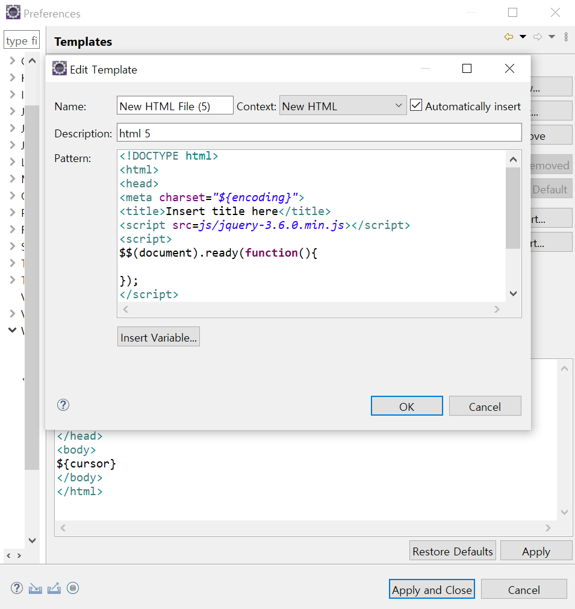

# jQuery 라이브러리

<br>

:milky_way: **책 범위**
- chapter 11 (HTML5 웹 프로그래밍 입문)

---

## jQuery 사용 목적

- 쉬운 문서 객체 모델(DOM)과 관련한 처리 구현
- 쉽고 일관된 이벤트 처리
- 쉬운 시각적 효과(CSS) 구현
- 쉬운 Ajax 응용 프로그램 개발

**결론 = 쉽다 !**

<br>

```jsx
// window.onload 이벤트와 같은 기능을 수행
$(document).ready(function() {
	실행 내용
});
```

---

## jQuery 환경설정

1. Tern Eclipse 설치
    - `프로젝트` - `우클릭` - `configure` - `convert to tern project` - `modules` - `browser, browser extention, jquery, jquery extention`
2. HTML 파일에 jQuery 태그 미리 정의
    - `Window` - `Preferences` - `Web` - `HTML files` - `Editor` - `Templates`
    
    
    

---

## 문서 객체 선택

#### jQuery 라이브러리 메서드의 기본 형태

```jsx
$(selector).메서드(매개변수, 매개변수);
```

:milky_way: **예제**
- [문서 객체 선택](./test/selector.html)

---

## 문서 객체 조작

#### 1. 속성 조작  
- `attr ()` : 문서 객체의 속성 조작
#### 2. 스타일 조작 
- `css()`
#### 3. 글자 조작 
- `html()` : 문서 객체 내부의 HTML 태그 조작
- `text()` : 문서 객체 내부의 글자 조작
#### 4. 클래스 조작
- `addClass()` : 클래스 추가
- `removeClass()` : 클래스 제거
- `toggleClass()` : 클래스 전환 (클래스 있으면 제거, 없으면 추가)
    
 <br>

:milky_way: **예제**
- [속성 조작](./test/attr.html)
- [스타일 조작](./test/css.html)
- [글자 조작](./test/text_html_append.html)
- [클래스 조작](./test/addClass_removeClass.html)
---

## 이벤트

#### 이벤트 사용

```jsx
// 이벤트 연결 메서드
on() 

// 이벤트 제거 메서드
off()

// 간단한 이벤트 연결 메서드 예시
$(document).ready(function() {});
```
 <br>
    
:milky_way: **예제**
- [이벤트 연결과 사용](./test/event1.html)
- [복합 이벤트 연결과 기본 이벤트 제거](./test/event2.html)

---

## 시각 효과

1. 시각 효과 메서드

```jsx
// 문서 객체가 작아지며 사라짐
hide(속도)
// 문서 객체가 커지며 표시
show(속도)

// 문서 객체가 흐려지며 사라짐
fadeOut(속도)
// 문서 객체가 선명해지며 표시
fadeIn(속도)

// 문서 객체가 슬라이드 효과와 함께 표시
slideDown(속도)
// 문서 객체가 슬라이드 효과와 함께 사라짐
slideUp(속도)

// 속도 문자열 : slow, normal, fast
```

2. 애니메이션 효과

```jsx
animate(function() {정의})
```

<br>

:milky_way: **예제**
- [시각 효과](./test/show_slide_fade.html)