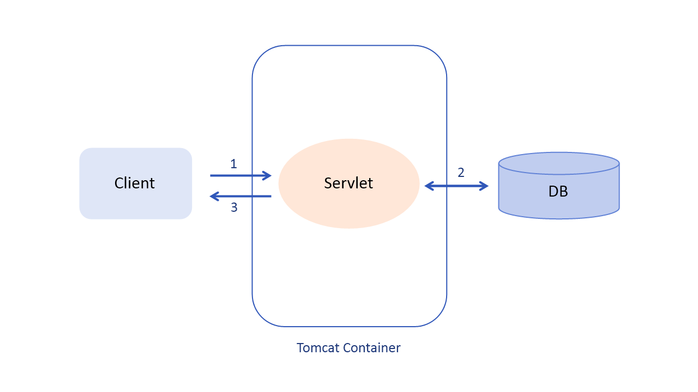
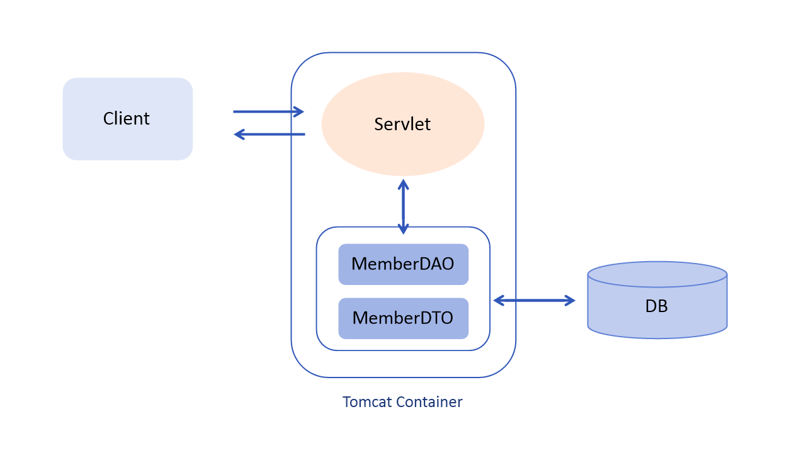
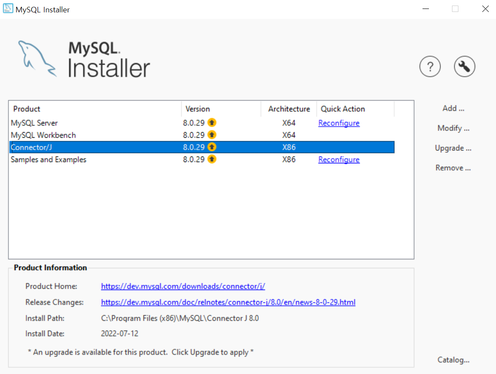

# 웹 브라우저에서 서블릿으로 데이터 전송하기
:milky_way: **책 범위**
- 6장

## GET/POST 전송 방식

- GET 방식
    - URL 주소에 데이터를 붙여서 전송
    - 보안과 관련이 없는 간단한 데이터를 쉽게 전송
- POST 방식
    - 전송하는 데이터를 숨겨서 전송
    - 보안과 관련된 데이터를 전송

| GET 방식 | POST 방식 |
| --- | --- |
| `URL?name=value&name=value` 형태로 전송 | TCP/IP 프로토콜 데이터의 body 영역에 숨겨진 채 전송 |
| 보안에 취약 | 보안에 유리 |
| 전송할 수 있는 데이터는 최대 255자 | 전송 데이터 용량 무제한 |
| 기본 전송 방식 | POST 방식으로 설정 변경 필요 : `<form action =”” method = ”post”>` |
| 서블릿 : `doGet()`을 이용해 데이터 처리 | 서블릿 : `doPost()`를 이용해 데이터 처리 |
| 웹 브라우저에 직접 입력해서 전송할 수 있고, 사용이 쉬움 | 전송 시 서블릿에서는 또다시 가져오는 작업을 해야 하므로 처리 속도가 GET 방식보다 느림 |

- 앞으로 간단한 예제는 모두 GET 방식으로 사용한다.
- 실제 프로젝트를 진행할 때에는 POST 방식을 사용한다.
- 데이터 전송 시 둘 다 퍼센트 인코딩(Percent-Encoding) 규약을 따른다.

 

:milky_way: **예제**
- [서블릿을 이용한 사칙연산 계산기 (+ 211p 실습 예제1 : 유효성 검사)](./test/calculator)

---

# 서블릿 비즈니스 로직 처리
:milky_way: **책 범위**
- 7장

## 서블릿의 비즈니스 로직 처리 방법
서블릿의 세 가지 기능 중 비즈니스 처리 과정이다.

1. 클라이언트로부터 요청을 받는다.
2. 데이터베이스 연동과 같은 비즈니스 로직을 처리한다.
3. 처리 결과를 클라이언트에게 돌려준다.

 

#### 서블릿 비즈니스 작업 예
- 웹 사이트 회원 등록 요청 처리 작업
- 웹 사이트 로그인 요청 처리 작업
- 쇼핑몰 상품 주문 처리 작업

---
## 서블릿의 데이터베이스 연동 과정

 

#### MySQL ConnectorJ 경로 찾기

