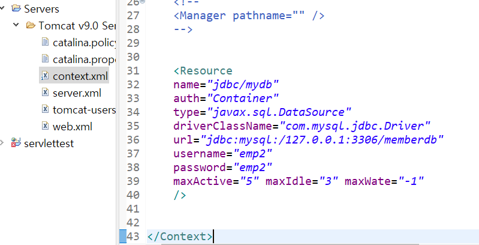
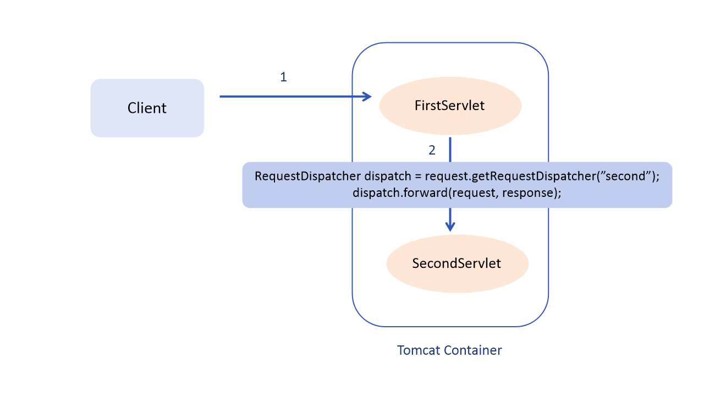
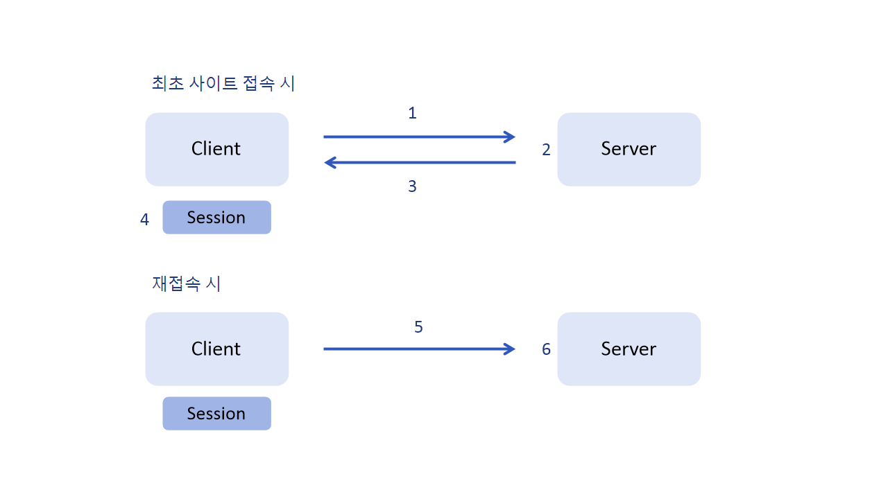
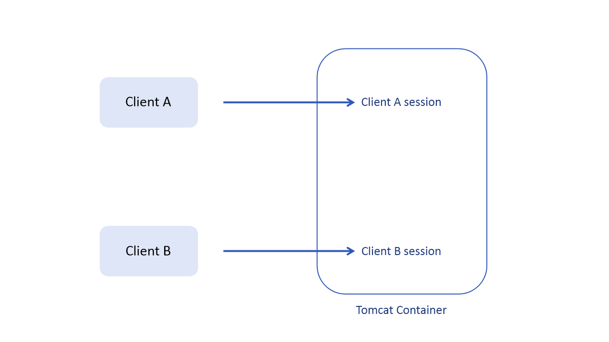

:milky_way: **목차**
- [DataSource 이용해 데이터베이스 연동하기](#datasource-이용해-데이터베이스-연동하기)
- [서블릿을 이용한 회원 CRUD 기능 구현](#서블릿을-이용한-회원-crud-기능-구현) 
- [포워드(dispatch)와 바인딩](#포워드dispatch와-바인딩)
- [세션](#세션)

<br>

---

# DataSource 이용해 데이터베이스 연동하기

:milky_way: **책 범위**
- 7장


## 커넥션풀 (ConnectionPool)

웹 컨테이너(WAS)가 실행되면서 DB와 미리 connection(연결)을 해놓은 객체들을 pool에 저장해두었다가, 

클라이언트 요청이 오면 connection을 빌려주고, 

처리가 끝나면 다시 connection을 반납을 받아 pool에 저장하는 방식이다.

커넥션풀은 기존 DB 연결 방식의 문제점을 해결해준다.

<br>

#### 기존 DB 연결 방법의 문제점
DB 연결에 시간이 많이 걸린다. 웹 서버 1개는 여러 클라이언트의 요청을 받아 멀티 스레드로 동작한다. DB 마다 최대 외부 접속 허용 개수는 한정되어 있다. 많은 사람들이 접속하면 웹 서버가 느려지거나 문제가 생길 수 있다.

#### connection pooling

웹 애플리케이션에서 ConnectionPool 객체를 구현할 때는 tomcat container가 자체적으로 제공하는 API 라이브러리로 사용한다.

- `javax.sql.DataSource`

---

## JNDI (Java Naming and Directory Interface)

웹 애플리케이션 실행 시 톰캣이 만들어 놓은 ConnectionPool 객체에 접근할 때 JNDI를 이용한다.

필요한 자원을 키/값(key/value) 쌍으로 저장한 후 필요할 때 키를 이용해 값을 얻는 방법이다.

- `javax.naming.Context`

---

## 톰캣의 DataSource 설정 및 사용방법

1. JDBC 드라이버를 `/WEB-INF/lib 폴더`에 설치 (mysql connectorJ)

2. context.xml에 Connection 객체 생성 시 연결할 데이터베이스 정보를 JNDI로 설정
    
    
    
3. DAO 클래스에서 데이터베이스와 연동 시 미리 설정한 JNDI라는 이름으로 데이터베이스와 연결하여 작업

<br>

:milky_way: **예제**
- [DataSource](./test/ConnectionServlet.java)

---

## 서블릿을 이용한 회원 CRUD 기능 구현 

:milky_way: **지금까지 배운 내용을 합친 종합 예제**
- [회원 CRUD 기능 구현하기](./test/member_CRUD)


---

# 포워드(dispatch)와 바인딩

:milky_way: **책 범위**
- 8장

## 포워드 (Forward)

하나의 서블릿에서 다른 서블릿이나 JSP로 요청을 전달하는 역할을 한다. 

- 요청에 대한 추가 작업을 다른 서블릿에게 수행하게 한다.
- 요청에 포함된 정보를 다른 서블릿이나 JSP와 공유할 수 있다.
- 요청에 정보를 포함시켜 다른 서블릿에 전달할 수 있다.
- 모델2 개발 시 서블릿에서 JSP로 데이터를 전달하는 데 사용된다.

---

## dispatch

서블릿의 포워드 방법 중 하나이다.

클라이언트의 웹 브라우저를 거치지 않고 바로 서버에서 포워딩이 진행된다. 

웹 브라우저 주소창의 URL이 변경되지 않기 때문에 클라이언트 측에서는 포워드가 진행되었는지 알 수 없다.

```java
Requestdispatcher  ds = request.getRequestDispatcher("포워드할 서블릿 또는 JSP");
ds.forward(request, response);
```

<br>

### redirect vs dispatch

`redirect`와 같은 다른 포워드 방법은 다른 서버로 이동 가능하다.

코드 한 줄로 다른 사이트 이동이 가능해 이상한 사이트로 이동하게 만들 수 있다.

즉, 보안성이 약해 위험하다.

<br>

`dispatch`는 " **현재 서버의 현재 컨텍스트 내부 파일로만 이동** " 만 가능하다.

즉, 보안성이 우수하고 안전하다.

---

## dispatch를 이용한 포워딩 수행 과정



1. 클라이언트의 웹 브라우저에서 첫 번째 서블릿에 요청
2. 첫 번째 서블릿은 `RequestDispatcher`를 이용해 두 번째 서블릿으로 포워드

---

 ## 바인딩 (binding)
 서블릿에서 다른 서블릿 또는 JSP로 대량의 데이터를 공유하거나 전달하고 싶을 때 사용한다. 

 ### 서블릿 객체에서 사용되는 바인딩 관련 메서드

 ```java
// 데이터를 각 객체에 바인딩
setAttribute(String name, Object obj)

// 각 객체에 바인딩 된 데이터를 name으로 가져오기
getAttribute(String name)

// 각 객체에 바인딩 된 데이터를 name으로 제거하기
removeAttributte(String name)

 ```
<br>

 :milky_way: **예제**
- [포워드(dispatch) +바인딩](./test/forward)

---

# 세션 

:milky_way: **책 범위**
- 9장

## 세션 (Session)
웹 페이지들 사이의 공유 정보를 서버의 메모리에 저장해놓고 사용하는 방법이다.

---

## 세션 트래킹 (Sesstion)
사용자 입장에서 웹 페이지 사이의 상태나 정보를 공유할 수 있도록 웹 페이지 연결 기능을 구현하는 것이다.

HTTP 프로토콜은 각 웹페이지의 상태나 정보를 다른 페이지들과 공유하지 않는 stateless 방식으로 통신한다.

따라서 웹 페이지나 서블릿끼리 상태나 정보를 공유하려면 웹 페이지 연결 기능, 즉 세션 트래킹을 이용해야 한다.

---

## 세션의 특징
- 정보가 서버의 메모리에 저장
- 브라우저의 세션 연동은 세션 쿠키를 이용
- 쿠키보다 보안에 유리
- 서버에 부하를 줄 수 있음
- 브라우저(사용자) 당 한 개의 세션(세션 id)이 생성
- 세션은 유효 시간이 o (기본 유효 시간은 30분)
- 로그인 상태 유지 기능이나 쇼핑몰의 장바구니 담기 기능 등에 주로 사용

---

## 세션 기능 실행 과정
 


1. 브라우저로 사이트 접속
2. 서버는 접속한 브라우저에 대한 세션 객체를 생성
3. 서버는 생성된 세션 id를 클라이언트 브라우저에 응답
4. 브라우저는 서버로부터 받은 세션 id를 브라우저가 사용하는 메모리의 세션 쿠키에 저장
5. 브라우저가 재접속하면 브라우저는 세션 쿠키에 저장된 세션 id를 서버에 전달
6. 서버는 전송된 세션 id를 이용해 해당 세션에 접근하여 작업을 수행

<br>


- 각 브라우저(사용자) 당 각 세션 객체가 생성된다.

---

## 세션 API


```java
// 서블릿에서 세션을 이용하려면 HttpSession 클래스 객체를 사용
// HttpSession 객체는 HttpServletRequest의 getSession() 메서드를 호출해서 생성

// 기존의 세션 객체가 존재하면 반환, 없으면 생성
getSession()
getSession(true)

// 기존의 새션 객체가 존재하면 반환, 없으면 null 반환
getSession(false)

// 현재 생성된 세션을 유지하기 위해 설정된 세션 유지 시간을 int 타입으로 반환
getMaxInactiveInterval()

// 속성 이름이 name인 속성 값을 Object 타입으로 반환, 해당되는 속성 이름이 없을 경우 null 값을 반환
getAttribute()

// 세션 속성 이름이 name인 속성에 속성 값으로 value를 할당
setAttribute(String name, Object value)

// 세션 속성 이름이 name인 속성을 제거 
removeAttribute(String name)

// 현재 생성된 세션을 소멸
invalidate()
```

<br>

 :milky_way: **예제**
- [세션](./test/session)