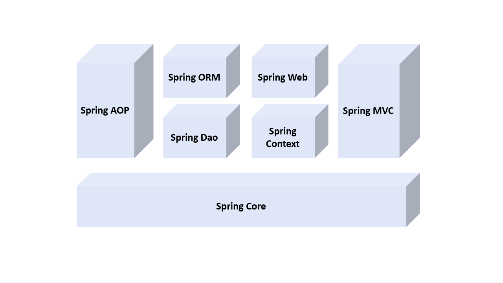

# 스프링 프레임워크 (Spring Framework)

:milky_way: **책 범위**
- 18장

 

:milky_way: **목차**
- [프레임워크 (Framework) 란 ?](#프레임워크-framework-란)
- [Spring Framework](#spring-framework)
- [Spring의 특징](#spring의-특징)
- [Spring의 주요 기능](#spring의-주요-기능)

 

---

## 프레임워크 (Framework) 란 ?
- 사전적 의미 : 어떤 것을 구성하는 구조 또는 뼈대
- 소프트웨어적 의미 : 기능을 미리 클래스나 인터페이스 등으로 만들어 제공하는 반제품

---

## Spring Framework
- 자바 웹 애플리케이션 개발을 위한 **오픈 소스 프레임워크**
- 기존 프레임워크보다 가벼운 경량 프레임워크(lightWeight Framework)
- 애플리케이션에서 사용되는 여러 가지 빈(클래스 객체)을 개발자가 아닌 스프링이 권한을 가지고 직접 관리

---

## Spring의 특징
- EJB 보다 가볍고 배우기 쉬우며 경량 컨테이너의 기능을 수행
- IoC(Inversion of Control) 
- DI(Dependency Injection)
- AOP(Aspect-Oriented Programming)
- 영속성과 관련된 다양한 서비스를 지원
- 수많은 라이브러리와의 연동 기능을 지원
- POJO(Plain Old Java Object) 클래스 사용 가능 (=이전 자바 클래스들 스프링 내부에서 사용 가능)

---

## Spring의 주요 기능

#### Core
다른 기능과 설정을 분리하기 위한 IoC 기능을 제공한다.

#### Context 
스프링의 기본 기능으로서 애플리케이션의 각 기능을 하는 빈(Bean)에 대한 접근 방법을 제공한다.

#### DAO 
JDBC 기능을 좀 더 편리하게 사용할 수 있도록 한다.

#### ORM
하이버네이트나 마이바티스 같은 영속성 관련 프레임워크와 연동된 기능을 제공한다.

#### AOP
관점 지향 기능을 제공한다.

#### Web
웹 애플리케이션 개발에 필요한 기능을 제공한다.

#### WebMVC
스프링에서 MVC 구현에 관련된 기능을 제공한다.

 

> 이후에 `Spring MVC + MyBatis` 로 프로젝트를 만들어보자.
