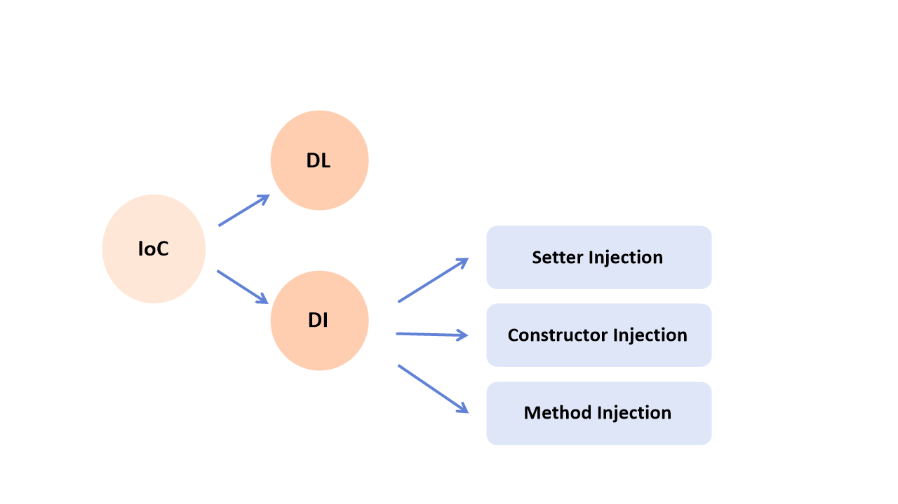

# IoC와 DI

:milky_way: **책 범위**
- 19장

<br>

:milky_way: **목차**
- [Inversion of Control(IoC) 이란 ?](#inversion-of-controlioc-이란)
- [Dependency Injection(DI) 이란?](#dependency-injectiondi-이란)
    1. [`xml` 방법](#xml-방법)
    2. [`annotation` 방법](#annotation-방법)

<br>

:milky_way: **예제**
- [DI (xml)](./test/memberservice)
- [DI (annotation)](./test/annotation.memberservice)

<br>

---

# Inversion of Control(IoC) 이란 ?

#### = 제어의 역전

#### = Spring IoC Container가 필요에 따라 개발자 대신 Bean들을 관리(제어)해주는 행위

<br>

- DL(Dependency Lookup) : 의존성 검색
- DI(Dependency Injection) : 의존성 주입




- **객체 관리의 주체**는 개발자가 아니라 **컨테이너**
- IoC Container는 객체 생성을 책임지고, 의존성을 관리
- POJO(Plain Old Java Object)의 생성, 초기화, 서비스, 소멸에 대한 권한 O
- 코드의 재사용성 가능 및 편리한 유지보수


---
# Dependency Injection(DI) 이란?

#### = 의존성 주입

<br>

- 각 객체간의 의존성을 스프링 컨테이너(Spring Container)가 자동으로 연결
- 개발자가 객체를 직접 생성하는 방식이 아니라 외부에서 생성하여 주입시켜주는 방식

<br>

#### 의존성 주입을 통해 얻는 장점
**IoC(Inversion of Control)** 의 하위 개념으로 객체 간의 결합을 약하게 해주고, 유지보수가 좋은 코드를 만든다.
개발자들이 객체를 생성하는 번거로움과 다양한 케이스를 고려하는 경우를 줄이고, 변수 사용과 개발에 더욱 집중할 수 있게 해준다.

<br>

- Dependency Reduction : 객체 상호 간 의존성 관계를 줄여준다.
- Reusable Structure : 코드의 재사용과 조합이 용이하다.
- Readability : 코드들이 분리되다보니 가독성이 좋아진다.
- Loose Coupling & Easy to change : 구조는 변화에 민감하지 않을 수 있다.
- Loosely Coupled : 각 클래스들의 변경이 자유롭다. (약한 결합)
- 테스트가 용이하고 다양한 패턴을 적용하는 것에 유연하다.

---

<br>


>
> 의존성 주입(DI)은 `xml` 또는 `annotation`을 이용한다.
>


<br>

## xml 방법

### Spring Bean Configuration File

#### 1. Setter Injection 
- setter를 이용한 DI 기능

```xml
<bean id="" class="" />
    <property name="" value="" or ref=""/>
</bean>
```

<br>

#### 2. Constructor Injection
- 생성자를 이용한 DI 기능

```xml
<bean id="" class="" />
    <constructor-arg name="" value="" or ref=""/>
</bean>
```

<br>

## `<bean>` 태그에 사용되는 여러 가지 속성들
- `id` : bean 객체의 고유 이름으로, bean id를 이용해 bean에 접근한다.
- `name` : 객체의 별칭이다.
- `class` : 생성할 클래스이다. 패키지 이름까지 입력해야 한다.
- `constructor-arg` : 생성자를 이용해 값을 주입할 때 사용한다.
- `property` : setter를 이용해 값을 주입할 때 사용한다.

---
## annotation 방법

### Spring configure 설정 필요
```xml
<context:component-scan base-package="패키지명" />
```
<br>

### Spring IoC Annotation
- `@Component` 
    - 스프링 컨테이너에 의해 해당 클래스 객체를 생성한다.
    - 스프링 bean으로 자동 등록된다. 
    - `@Component` : 주로 기타 자원 클래스에서 사용한다. (ex) MemberDTO)
    
    


<br>

- `@Autowired` 
    - 연관된 스프링 bean을 Type에 따라 스프링 컨테이너에서 찾아서 주입해준다.
    - Type을 먼저 확인하고 못 찾는다면 name에 따라 bean을 주입해준다.   
    - 해당 타입의 bean 객체가 존재하지 않거나, 2개 이상 존재한다면 예외가 발생한다.
    - 같은 타입의 객체가 2개 이상이라면 `@Qualifier("이름")`와 같이 사용하면 된다.
- `@Resource(name="")`  
    - `@Autowired`와 같이 스프링 bean을 Type으로 검색하지만 name을 지정한다는 차이점이 있다.

---
## 스프링 빈(Bean)이란 ?
- 스프링 컨테이너에 의해 만들어진 자바 객체