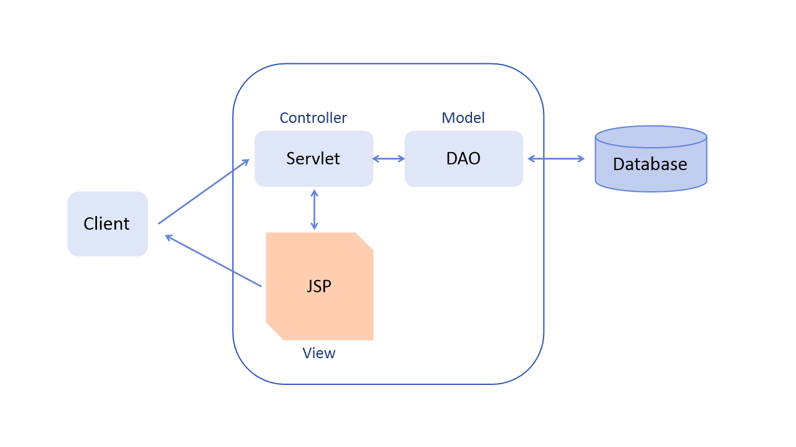
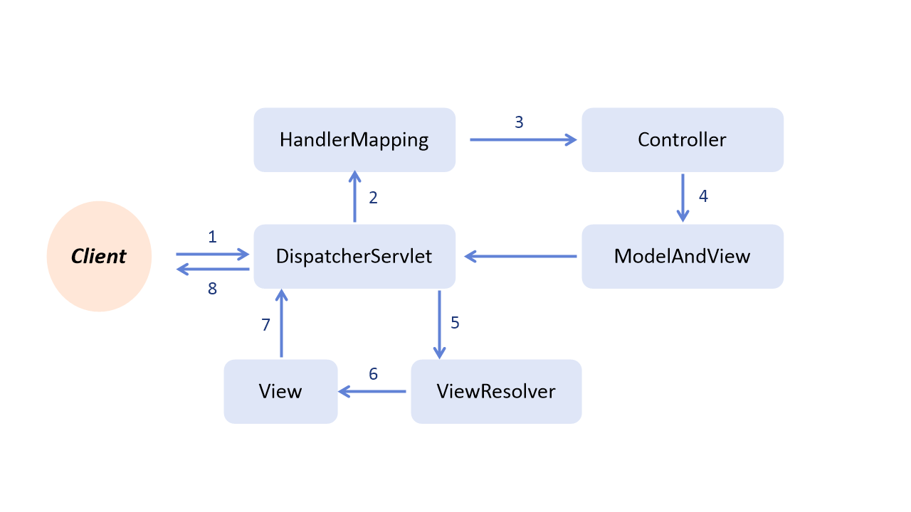

# MVC

:milky_way: **책 범위**
- 21장

 

:milky_way: **목차**
- [MVC 란 ?](#mvc란)
    - [MVC의 특징](#mvc의-특징)
    - [MVC 디자인 패턴](#mvc-디자인-패턴)
    - [MVC를 지키면서 코딩하는 방법](#mvc를-지키면서-코딩하는-방법)
  
- [스프링 프레임워크 MVC](#스프링-프레임워크-mvc)
    1. [스프링 프레임워크 MVC 구성 요소](#스프링-프레임워크-mvc-구성-요소)
    2. [스프링 프레임워크 MVC 기능 수행 과정](#스프링-프레임워크-mvc-기능-수행-과정)

 

:milky_way: **예제**
- [mvc](./test/mvc)

 

---

## MVC란 ?
MVC는 Model-View-Controller의 약자이다.일반 PC 프로그램 개발에 사용되는 디자인 패턴을 웹 애플리케이션에 도입한 것이다. 웹 애플리케이션을 화면 부분, 요청 처리 부분, 로직 처리 부분으로 나누어 개발하는 방법이다. 모델2 방식의 구조가 MVC를 포함하는 개념이지만 MVC가 모델2 방식의 뼈대를 이루므로 모델2 방식으로 구현한다는 말은 곧 MVC로 구현한다는 것과 같은 의미로 본다.

---
## MVC의 특징
- 각 기능이 분리되어 있어 개발과 유지보수가 편리하다.
- 각 기능의 재사용성이 높아진다.
- 디자이너와 개발자의 작업을 분업화해서 쉽게 개발할 수 있다.

---
## MVC 디자인 패턴

## Model
- 비즈니스 로직을 처리한다.
- 데이터와 관련된 부분이다.

## View
- 사용자에게 보여줄 화면을 담당한다.

## Controller
- 사용자의 요청 및 흐름 제어를 담당한다. 
- Model과 View를 이어주는 부분이다.

---
## MVC를 지키면서 코딩하는 방법
1. Model은 Controller와 View에 의존하지 않아야 한다. 
2. View는 Model에만 의존해야 하고, Controller에는 의존하면 안된다.
3. View가 Model로부터 데이터를 받을 때는, 사용자마다 다르게 보여주어야 하는 데이터에 대해서만 받아야 한다.
4. Controller는 Model과 View에 의존해도 된다.
5. View가 Model로부터 데이터를 받을 때, 반드시 Controller에서 받아야 한다.

 

:milky_way: **출처**
- [[10분 테코톡]제리의 MVC 패턴](https://www.youtube.com/watch?v=ogaXW6KPc8I)

---

# 스프링 프레임워크 MVC

## 스프링 프레임워크 MVC 구성 요소
- `DispatcherServlet` : 클라이언트의 요청을 전달받아 해당 요청에 대한 컨트롤러를 선택하여 클라이언트의 요청을 전달한다. 또한 컨트롤러가 반환한 값을 View에 전달하여 알맞은 응답을 생성한다.
- `HandlerMapping` : 클라이언트가 요청한 URL을 처리할 컨트롤러를 지정한다.
- `Controller` : 클라이언트의  요청을 처리한 후 그 결과를 DispatcherServlet에 전달한다.
- `ModelAndView` : 컨트롤러가 처리한 결과 및 뷰 선택에 필요한 정보를 저장한다.
- `ViewResolver` : 컨트롤러의 처리 결과를 전달할 뷰를 지정한다.
- `View` : 컨트롤러의 처리 결과 화면을 생성한다.

---

## 스프링 프레임워크 MVC 기능 수행 과정

1. 브라우저가 DispatcherServlet에 URL로 접근하여 해당 정보를 요청한다.
2. HandlerMapping에서 해당 요청에 대해 매핑된 컨트롤러가 있는지 요청한다.
3. 매핑된 컨트롤러에 대해 처리를 요청한다.
4. 컨트롤러가 클라이언트의 요청을 처리한 결과와 View 이름을 ModelAndView에 저장해서 DispatcherServlet으로 반환한다.
5. DispatcherServlet에서는 컨트롤러에서 보내온 View 이름을 ViewResolver로 보내 해당 View를 요청한다.
6. ViewResolver는 요청한 View를 보낸다.
7. View의 처리 결과를 DispatcherServlet으로 보낸다.
8. DispatcherServlet은 최종 결과를 브라우저로 전송한다.

