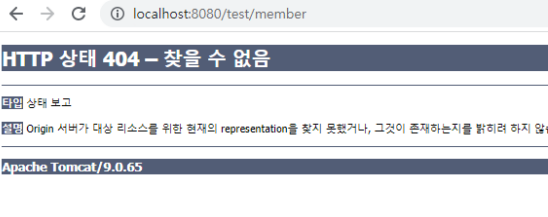
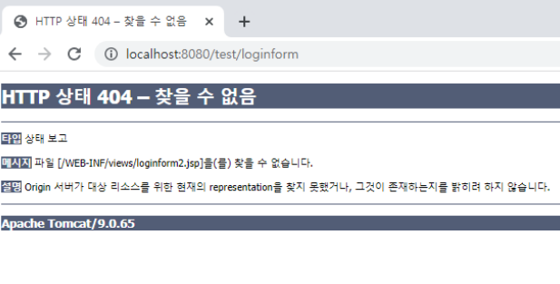

# MVC
:milky_way: **책 범위**
- 21장, 26장

<br>

:milky_way: **목차**
- [Spring MVC Annotation](#spring-mvc-annotation)
- [xml 파일 설정](#xml-파일-설정)
- [@Controller와 @RequestMapping 메서드 리턴타입](#controller와-requestmapping-메서드-리턴타입)
- [@Controller와 @RequestMapping 메서드 매개변수](#controller와-requestmapping-메서드-매개변수)
- [Spring MVC 오류](#spring-mvc-오류)

<br>
---

## Spring MVC Annotation
예제를 통해 아래 적힌 어노테이션의 기능을 익히자.

<br>

:milky_way: **예제**
- [로그인](./test/annotation)

<brs>

- `@Controller`
- `@RequestMapping("url")`
- `@RequestParam("요청파라미터명") `
- `@ModelAttribute("모델명")`
- `@RequestMapping(value="url", method=RequestMethod.GET|POST)`
- `@GetMapping("")`
- `@PostMapping("")`

---

## xml 파일 설정
- Spring MVC와 maven을 이용한 프로젝트 

<br>

#### 1. web.xml
- `src/main/webapp/WEB-INF/web.xml`
- 서블릿 매핑
- welcome file 리스트
- web, spring mvc 웹 환경설정 파일

```xml
<!-- 한글 인코딩 처리 : filter 클래스 (utf-8로 필터링을 해준다.) : 서블릿, jsp, 컨트롤러 DispatcherServlet -->
	<filter>
		<filter-name>encoding</filter-name>
		<filter-class>org.springframework.web.filter.CharacterEncodingFilter</filter-class>
		<init-param>
			<param-name>encoding</param-name>
			<param-value>utf-8</param-value>
		</init-param>
	</filter>
	<filter-mapping>
		<filter-name>encoding</filter-name>
		<url-pattern>/*</url-pattern>
	</filter-mapping>
```

<br>

#### 2. pom.xml
- `프로젝트명/pom.xml`
- maven 라이브러리
- 스프링 라이브러리 버전, 추가 설정 

<br>

#### 3. servlet-context.xml
- `src/main/webapp/WEB-INF/spring/appServlet/servlet-context.xml`
- Spring MVC 설정

:bulb: annotation 사용 시 작성
```xml
<context:component-scan base-package="annotation.springmvc" />
```
<br>

:bulb: xml로 url 매핑 시 작성 
- 앞으로는 이 방법 대신 annotation을 사용할 것이다. 알아만 두고 넘어가자!
```xml	
<!-- spring mvc HandlerMapping hello-HelloController() 객체 생성) -->

<beans:bean id="hello" class="springmvc.HelloController"/>
<beans:bean id="list" class="springmvc.ListController"/>
<beans:bean id="form" class="springmvc.LoginFormController"/>
<beans:bean id="result" class="springmvc.LoginResultController"/>

<beans:bean id="urlMapping" class="org.springframework.web.servlet.handler.SimpleUrlHandlerMapping">
	<beans:property name="mappings">
		<beans:props>
			<beans:prop key="/hello">hello</beans:prop>
			<beans:prop key="/list">list</beans:prop>
			<beans:prop key="/loginform">form</beans:prop>
			<beans:prop key="/loginresult">result</beans:prop>
		</beans:props>
	</beans:property>
</beans:bean>
```

---
## @Controller와 @RequestMapping 메서드 리턴타입
- `ModelAndView` : 모델 O, 뷰 O
- `String` : 모델 X, 뷰 O
- `return "redirect:/loginform"` : /loginform로 URL 매핑한 메서드가 호출
- `void`  : 모델 X, 뷰 O (매핑한 URL과 동일한 이름을 가진 JSP)
- 그밖의 기타 다른 리턴타입 : 객체를 리턴한다. (= ajax)
---
## @Controller와 @RequestMapping 메서드 매개변수
- 없어도 된다.
- Servlet API : HttpServletRequest, HttpServletResponse
- String , String[]
- form -> DTO -> db insert 
- Map
---
## Spring MVC 오류

### 404
- 컨트롤러가 없거나 jsp 없다.


- /member 매핑 컨트롤러가 없다.
- 해결 : 컨트롤러 클래스 정의 + `servlet-context.xml` 매핑값 확인 추가 설정

<br>


- URL 컨트롤러는 있지만 jsp는 없다
- 해결 : 파일 위치(`src/main/webapp/resources/...`)를 확인한다  
<br>

### 405
- get요청을 post처리하거나 post요청을 get처리한다.
- 서블릿에서 자주 jsp 요청방식 처리 동일하게 하는 경우이다.
- Spring MVC 요청방식 따라 다르게 처리한다.
<br>

### 400
- 폼 입력 데이터나 컨트롤러 메서드 매개변수 타입의 문제이다.
<br>

### 500
서블릿, jsp, Spring MVC 예외