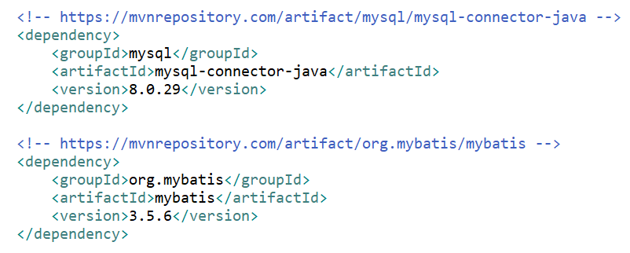

# MyBatis


---

## 마이바티스(MyBatis) 란 ?
- 데이터베이스 연동 관련 프레임워크
- SQL Mapper Framework
- 기존 JDBC 연동 방식을 개선해 SQL문의 가독성을 높여 사용하기 편하게 만든 것

<br>

#### 기존 JDBC 연동 방식의 단점
- SQL문이 프로그래밍 코드에 섞여 코드를 복잡하게 만든다. 
- `connection - Statement 객체 생성 - SQL문 전송 - 결과 반환 - close`

---

## 마이바티스 프레임워크의 특징
- SQL 실행 결과를 자바 빈즈 또는 Map 객체에 매핑해 주는 Persistence 솔루션으로 관리한다. 즉, SQL을 소스 코드가 아닌 XML로 분리한다.
- SQL문과 프로그래밍 코드를 분리해서 구현한다.
- 데이터소스(DataSource) 기능과 트랜잭션 처리 기능을 제공한다.

---

## MyBatis 실습

>
>Spring DB 연동 방법은 세 가지가 있다.
>
>1. JDBC (java.sql.* 사용)
>2. Spring JDBC (Spring api org.spring ...)
>3. MyBatis 프레임워크 기능
>
>
>1번 방법은 최근에 MySQL 공부할 때 배웠다.
>
>이제 MyBatis를 사용해보자.
>
>오늘은 Spring과 연동하지 않고, MyBatis만 알아본다.
>
>따라서 Spring annotation은 사용하지 못하기 때문에 setter 설정 등이 필요하다.
>
<br>

### 0. pom.xml 설정
- MySQL JDBC driver.jar
- MyBatis.jar



<br>

---

### 1. mybatis-config.xml

: MyBatis에서 사용할 DB 연동을 위한 설정과 sql-mapping.xml 등록 

```xml
<?xml version="1.0" encoding="UTF-8"?>

<!DOCTYPE configuration PUBLIC "-//mybatis.org//DTD Config 3.0//EN"
  "http://mybatis.org/dtd/mybatis-3-config.dtd">

<!-- MyBatis DB 연결 정보 세팅 -->

<configuration>
	<!-- DB 연결 정보에 따라 DB 생성 -->
	<environments default="mydb">
		<environment id="mydb">
			<transactionManager type="JDBC" />
			<dataSource type="POOLED">
				<property name="driver" value="com.mysql.cj.jdbc.Driver"/>
				<property name="url" value="jdbc:mysql://127.0.0.1:3306/memberdb"/>
				<property name="username" value="emp2"/>
				<property name="password" value="emp2"/>
			</dataSource>
		</environment>
	</environments>
	
	<!-- SQL 정의 파일명 -->
	<mappers>
		<mapper resource="mybatis/sql-mapping.xml" /> 
	</mappers>
</configuration>
```

- environment id를 구분하여 여러 개의 DB를 연결할 수 있다.
- mapper는 기능에 따라 따로 분류를 해서 테이블 단위로 만들어주는 것도 좋다. (ex) board-mapping, book-mapping)

<br>

---

### 2. sql-mapping.xml

- SQL문 설정

```xml
<?xml version="1.0" encoding="UTF-8"?>
<!DOCTYPE mapper PUBLIC "-//mybatis.org//DTD Mapper 3.0//EN"
  "http://mybatis.org/dtd/mybatis-3-mapper.dtd">

<mapper namespace="member"> 
	
	<select id="memberlist" resultType="mybatis.MemberDTO"> 
		select * from member
	</select>

	<select id="membercount" resultType="int">
		select count(*) from member
	</select>
	
	<!-- 파라미터 1개 -->
	<select id="onemember" resultType="mybatis.MemberDTO" parameterType="String">
		select * from member where id=#{id} 
	</select>

	<!-- 배열 : <foreach> 반복문 사용 (collection은 array이므로 parameterType은 int[] 자동 설정) -->
	<select id="paginglist" resultType="mybatis.MemberDTO" >
		<foreach collection="array" item="num" separator=",">
		select * from member order by regdate limit 
		#{num}
		</foreach>
	</select>

	<!-- 파라미터 여러 개  -->
	<insert id="insertmember" parameterType="mybatis.MemberDTO">
		insert into member values(#{id},#{password},#{name},#{phone},#{email},now())
	</insert>

</mapper>
```

- mapper 태그의 `namespace` 속성
- SQL 문을 담은 태그 설정
    - `id` 속성
    - `resultType` 속성
        - SQL문 실행 결과의 리턴 타입이다.
        - 리턴 타입이 int 이면 int라고 쓴다.
        - 객체라면 앞에 패키지명을 붙인다. (ex) 패키지명.MemberDTO)
        - 기본값 : ResultSet
    - `parameterType` 속성
        - 파라미터가 있을 때 사용한다.
    - `#{ }`
        - 파라미터 값 설정
- 추후 DAO에서 연결한다.
    
<br>

---

### Main

- `mybatis-config-xml` 을 읽어 DB를 연결한다.
- DAO 객체를 생성하고,  DAO에게 session을 넘겨준다.
- Service 객체를 생성하고, DAO에게 일을 시킨다.
- Service의 메서드를 호출하고, Service의 메서드가 반환한 리턴 값을 저장 후 출력한다.

```java
package mybatis;

import java.io.IOException;
import java.util.List;
import java.util.Scanner;

import org.apache.ibatis.io.Resources;
import org.apache.ibatis.session.SqlSession;
import org.apache.ibatis.session.SqlSessionFactory;
import org.apache.ibatis.session.SqlSessionFactoryBuilder;

public class MemberMain {
	public static void main(String[] args) throws IOException {

		// 'mybatis-config.xml' 읽기
		SqlSessionFactoryBuilder builder = new SqlSessionFactoryBuilder();
		SqlSessionFactory factory = builder.build(Resources.getResourceAsReader("mybatis/mybatis-config.xml"));
		// DB 연결
		SqlSession session = factory.openSession(); 
		
		MemberDAO dao = new MemberDAO();
		dao.setSession(session); // dao에게 session을 넘겨준다.
		
		MemberServiceImpl service = new MemberServiceImpl();
		service.setDao(dao); // dao에게 일을 시킨다. 
		
		// 1. memberlist() : 전체 회원 리스트와 전체 회원 수를 조회
		List<MemberDTO> list = service.memberlist();
		
		for(int i=0; i<list.size()-1; i++) {
			System.out.println(list.get(i));
		}
		
		System.out.println("총 회원 수 = " +list.get(list.size()-1).getPassword());

		
		// 2. onemember() : 키보드로 id를 입력 받아 특정 멤버 조회
		Scanner key = new Scanner(System.in);
		System.out.println("조회할 회원의 아이디를 입력하세요.");
		String id = key.next();
		List<MemberDTO> list2 = service.onemember(id);
		
		for(MemberDTO dto : list2) {
			System.out.println(dto.getId() + ":" + dto.getName());
		}
		
		
		// 3. paginglist() : 페이징 처리 
				// 키보드 입력 : 1 -> 등록시간순으로 나열하여 가장 빠른 4명을 출력 1페이지
			    // 키보드 입력 : 2 -> 등록시간순으로 나열하여 5,6,7,8번째 출력
		int[] limit = {0, 4};
		List<MemberDTO> list3 = service.paginglist(limit);
		for(MemberDTO dto : list3) {
			System.out.println(dto);
		}
	}
}
```

<br>

---

### Service 인터페이스

```java
package mybatis;

import java.util.List;

public interface MemberService {
	public List<MemberDTO> memberlist();
	public List<MemberDTO> onemember(String id);
	public List<MemberDTO> paginglist(int[] limit);
}
```

<br>

---

### Service 클래스

- MemberDAO 호출
- MemberDAO의 메서드 리턴 값을 저장해서 반환한다. (Main으로)

```java
package mybatis;

import java.util.List;
public class MemberServiceImpl implements MemberService {
	MemberDAO dao;
	
	public void setDao(MemberDAO dao) {
		this.dao = dao;
	}
	
	@Override
	public List<MemberDTO> memberlist() {
		List<MemberDTO> list =  dao.getList();
		
		// 리턴값이 list 라서 약간 억지로 count를 MemberDTO의 int password에 넣어서 반환 
		int count = dao.getCount();
		list.add(new MemberDTO(null, count, null, null, null, null));
		
		return list;
	}
	
	@Override
	public List<MemberDTO> onemember(String id) {
		return dao.oneMember(id);
	}
	
	@Override
	public List<MemberDTO> paginglist(int[] limit) {
		return dao.pagingList(limit);
	}
}
```

<br>

---

### DAO

- Main에서 session 가져온다.
- `sql-mapping.xml` 에서 작성한 SQL문을 실행하고, 실행한 결과를 리턴 (Service로)

```java
package mybatis;

import java.util.List;

import org.apache.ibatis.session.SqlSession;

public class MemberDAO {
	// 메인에서 session 가져온다. 아직 어노테이션 사용할 수 없기 때문에 역시 setter 만들어준다.
	SqlSession session;
	// setter
	public void setSession(SqlSession session) {
		this.session = session;
	}
	
	public List<MemberDTO> getList() {
		return session.selectList("member.memberlist");
	}
	
	public int getCount() {
		return session.selectOne("membercount");
	}

	// onemember라는 id를 가진 sql에 id를 전달해 SQL문을 실행하고 결과를 MemberDTO 타입의 list로 리턴
	public List<MemberDTO> oneMember(String id) {
		return session.selectList("onemember", id); 
	}
	
	// pagintlist라는 id를 가진 sql에 int 배열을 전달해 SQL문을 실행하고 MemberDTO 타입의 list로 리턴
	public List<MemberDTO> pagingList(int[] limit) {
		return session.selectList("paginglist", limit);
	}
}
```

- `session.selectOne("query_id")` :
    - id에 대한 select문을 실행한 후 한 개의 레코드를 지정한 타입으로 변환한다.
- `sessionOne("query_id", '조건)` :
    - id에 대한 select문을 실행하면서 조건(쿼리문에서 사용할 인자)를 전달한다.
- `session.selectList("query_id")` : id에 대한 select문을 실행한 후 레코드를 List로 반환한다.
- `session.selectList("query_id", 조건)`
    - id에 대한 select문을 실행하면서 조건(쿼리문에서 사용할 인자)를 전달한다.

<br>

---

### DTO
```java
package mybatis;

public class MemberDTO {
	String id;  
	int password;
	String name; 
	String phone;  
	String email;  
	String regdate;
 
	public MemberDTO(){ }
	
	// 생성자
	public MemberDTO(String id, int password, String name, String phone, String email, String regdate) {
		super();
		this.id = id;
		this.password = password;
		this.name = name;
		this.phone = phone;
		this.email = email;
		this.regdate = regdate;
	}
	
// getter와 setter
	public String getId() {
		return id;
	}
	public void setId(String id) {
		this.id = id;
	}
	public int getPassword() {
		return password;
	}
	public void setPassword(int password) {
		this.password = password;
	}
	public String getName() {
		return name;
	}
	public void setName(String name) {
		this.name = name;
	}
	public String getPhone() {
		return phone;
	}
	public void setPhone(String phone) {
		this.phone = phone;
	}
	public String getEmail() {
		return email;
	}
	public void setEmail(String email) {
		this.email = email;
	}
	public String getRegdate() {
		return regdate;
	}
	public void setRegdate(String regdate) {
		this.regdate = regdate;
	}

	@Override
	public String toString() {
		return id + " 회원님의 이름은 " + name + " , 폰번호는 " + phone + " , 이메일은 " + email
			+ " , 가입일은 " + regdate + " 입니다.";	
	}	
}
```