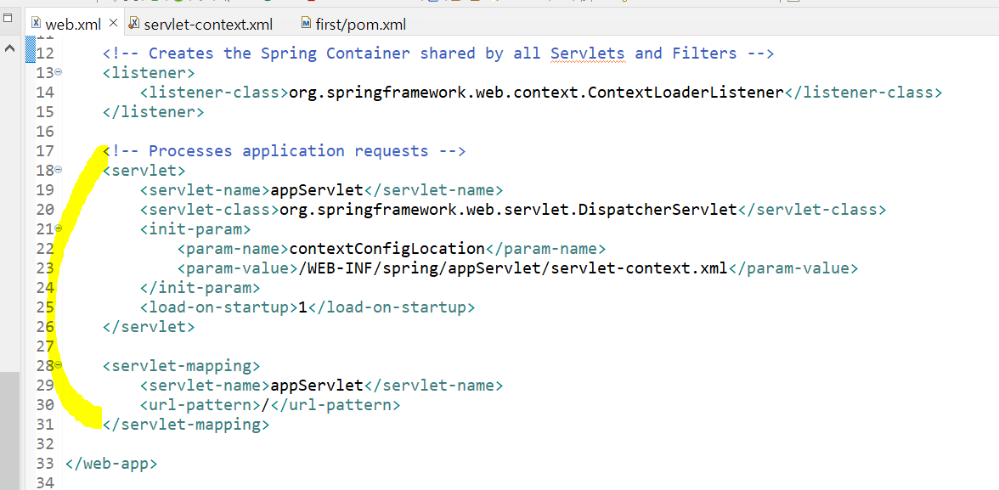

### nonspringmvc
- `dynamic web project`
- 스프링 mvc 라이브러리를 대체해 수동으로 직접 구현해본 것이다.
- mvc 구조를 이해하는데 초점을 두기 위해서 간단히 JSP에서 el이나 jstl은 액션 태그로 대체한다.

#### `http://localhost:8080/nonspringmvc/hello` 수행 과정

---
### springmvc
- `spring legacy project`
- nonspringmvc에서 구현했던 아래 세 파일의 기능은 spring이 해준다.
    - `dispatcherServlet`
    - `handlermapping`
    - `controller 인터페이스`

---
>
>xml 파일 중 중요한 세 가지를 알아보자.
>
- `web.xml` : 서블릿 매핑, welcome file 리스트, web/spring/mvc 웹 환경 설정 파일 
- `pom.xml` : maven 라이브러리 관련 파일
- `servlet-context.xml` : spring mvc 관련 설정 파일 

 

