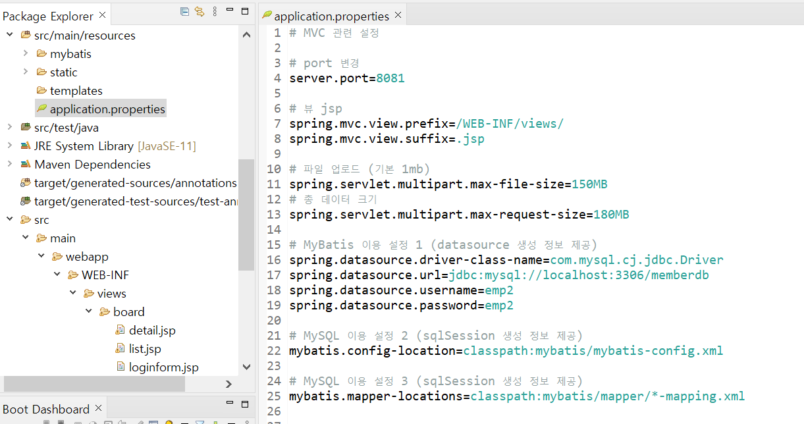
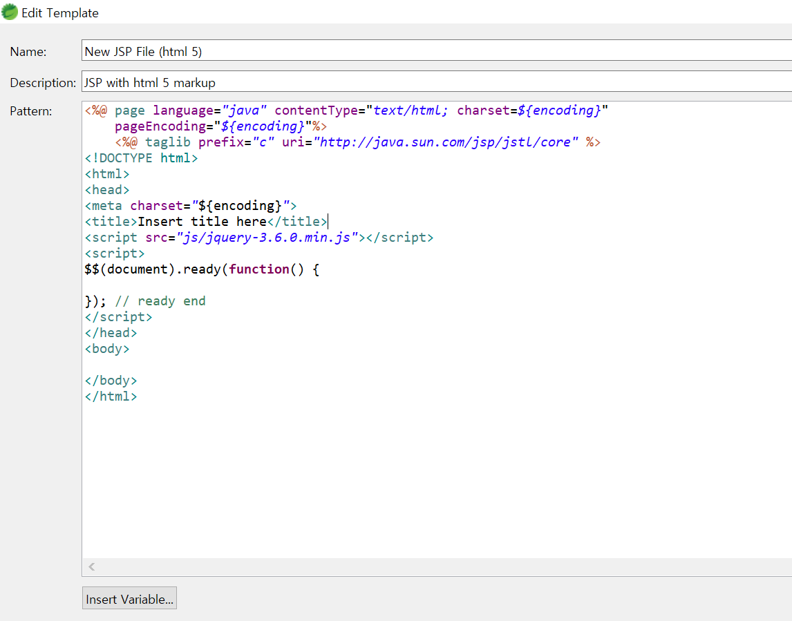
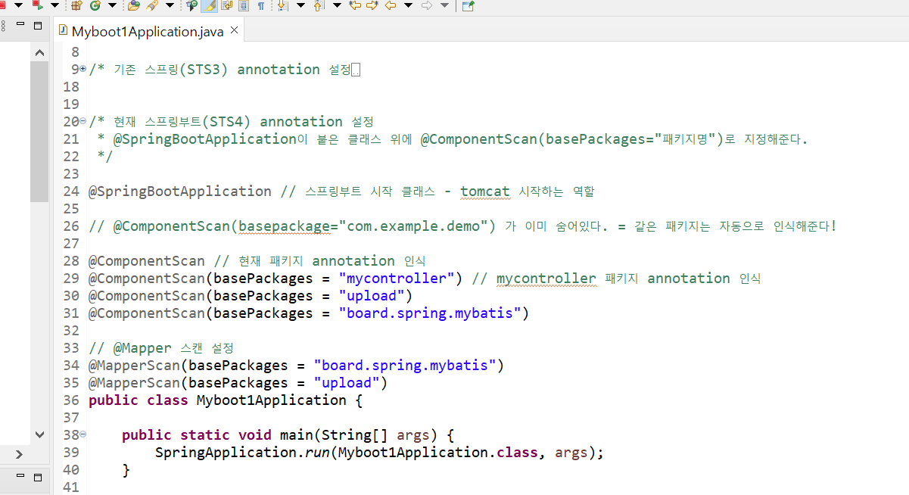
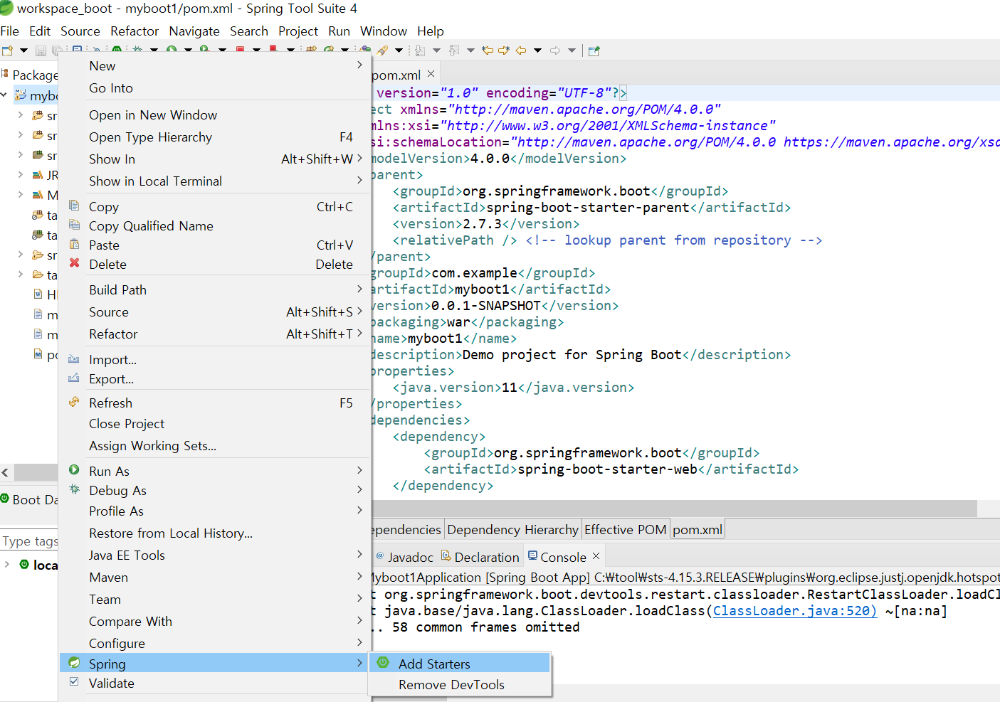
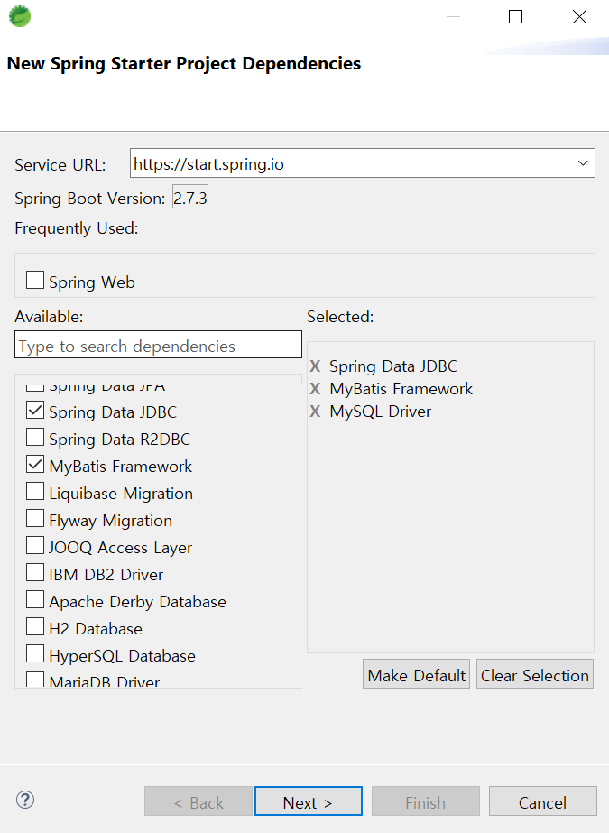
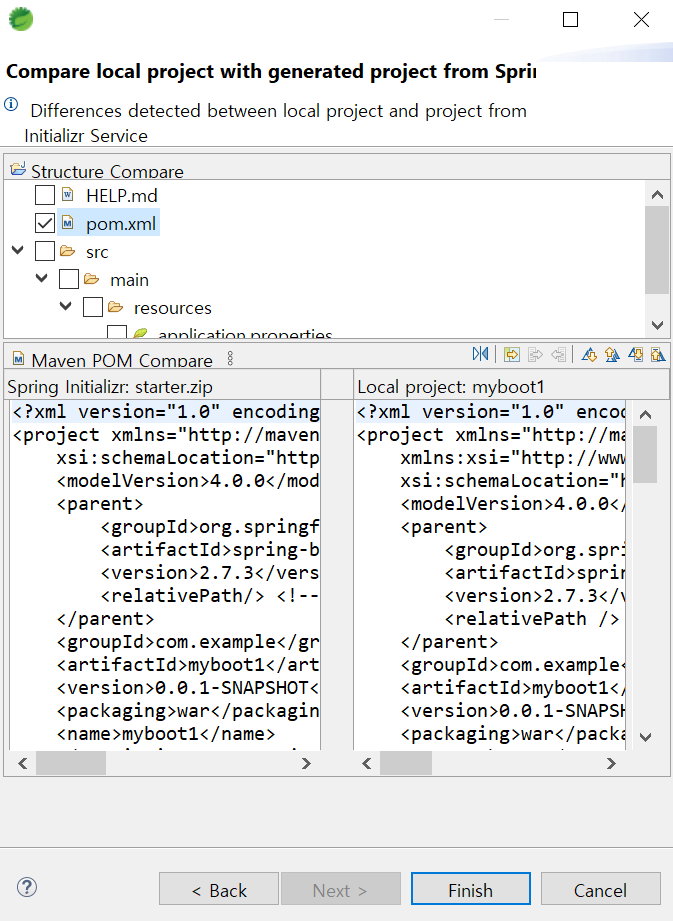
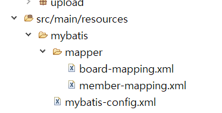
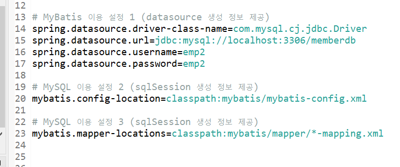
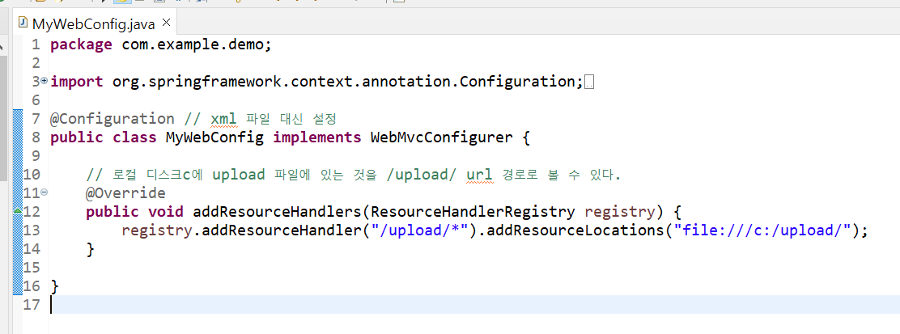

# SpringBoot MVC 환경 설정
- `Spring stater Project - Web - Spring web`

<br>

## 0. application.properties
- 여러 가지 설정


---
## 1. JSP 파일 사용을 위한 준비
#### 0. `Help - Eclipse Marketplace - Eclipse Enterprise Java and Web Developer Tools` 설치

<br>

#### 1. `pom.xml`
```xml
<!-- for jsp -->
<dependency>
	<groupId>org.apache.tomcat.embed</groupId>
	<artifactId>tomcat-embed-jasper</artifactId>
	<scope>provided</scope>
</dependency>

<!-- for jsp jstl -->
<dependency>
	<groupId>javax.servlet</groupId>
	<artifactId>jstl</artifactId>
</dependency>

<!--for tomcat restart - starter에서 선택 가능-->
<dependency>
    <groupId>org.springframework.boot</groupId>
    <artifactId>spring-boot-devtools</artifactId>
    <optional>true</optional>
</dependency>
```

---
## 2. UTF-8 설정
- `Window - Preferences - Web`

---
## 3. jstl, jquery
- `src/main/resources - static - js`에 `jquery-3.6.0.min.js` 넣기
- `window - preperties - jsp files - template`


---
## 4. annotation 인식
- `@SpringBootApplication`이 붙은 클래스에 작성한다. 


---
## 5. MyBatis 연동

#### 0. `Add Starters`





<br>

#### 1. 경로 설정


<br>

#### 2. `application.properties` 


---
## 6. DAO
기존 STS3과 작성법이 다르다.

<br>

#### 0. DAO 파일은 interface로 작성해야 한다.
```java
// ex) BoardDAO
@Mapper
@Repository("boarddao")
public interface BoardDao {
    public int insertBoard(BoardDTO dto);
}
```

<br>

#### 1. 매핑하는 xml 파일에 맞춰 DAO를 작성해야 한다.
```xml
<!-- ex) board-mapping.xml -->
<mapper namespace="board.spring.mybatis.BoardDAO">

    <insert id="insertBoard" parameterType="boarddto">
        insert into board values ...
    </insert>

</mapper>
```
- `<mapper namespace="패키지명.DAO인터페이스명">`
- `<SQL문 태그 id="DAO의 메서드명" parameterType="DAO의 매개변수" resultType="DAO의 리턴타입">`

<br>

#### 2. `@SpringBootApplication 클래스`에 패키지마다 `@MapperScan` annotation 붙여주어야 한다.

---

## 7. MyWebConfig
- application.properties 외 추가 설정을 여기서 한다.


