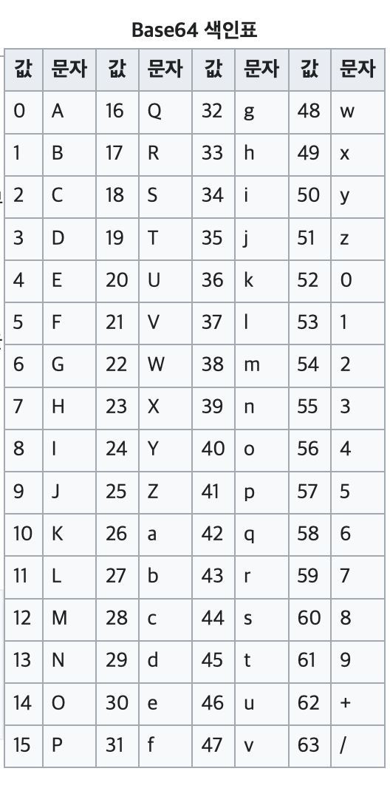
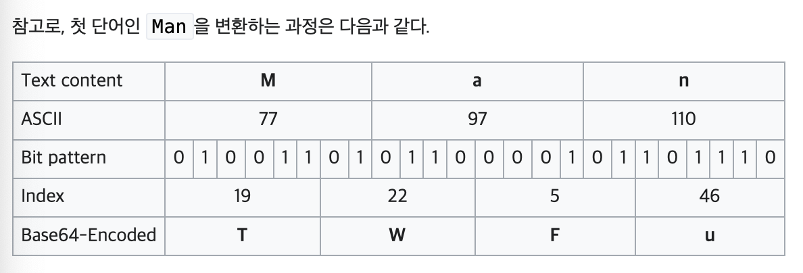

# Socket, JSON, Base64

## Thread

- 숙어처럼 쓰이는 코드 !

```java
run() {
	while (!Thread.currentThread.isInterrupted) {
	}
}

catch (InterruptedException e) {
            Thread.currentThread().interrupt();
}

// Thread.interrupted() : static 메소드라 사용하면 X.
```

- composition 방식 : **implements Runnable**
- extends Thread는 subClassing 이다.

### ServerSocket : Race Condition 방지

```java
ServerSocket serverSocket = new ServerSocket();

Synchronized() {
	serverSocket.accept();
}
```

### Java property Option

```java
Option property  = Option.builder("D")
                   .hasArgs()
                   .valueSeparator('=')
                   .build();
```

```java
// ex
String[] testArgs = new String[] {"-c" "-all", "--block-size=10", "-D key=value"};
```

---

# JSON

### **JSONObject**

JSONObject 생성자는 외부 형식인 JSON 텍스트를 get 및 opt 메서드를 사용하여 값을 검색할 수 있는 내부 형식으로 변환하거나 put 및 toString 메서드를 사용하여 값을 JSON 텍스트로 변환하는 데 사용할 수 있다.

- JSON 객체 생성

```java
JSONObject object = new JSONObject();

object.put("name", "suebin");
object.put("address", "1111");
object.put("detail", new JSONObject());

BufferedWriter writer = new BufferedWriter(new OutputStreamWriter(System.out));
writer.write(object.toString(3));
writer.flush();
```

- JSON 파일 생성

```java
BufferedWriter fileWriter = new BufferedWriter(new OutputStreamWriter(new FileOutputStream("./info.json")));
fileWriter.write(object.toString(3));
fileWriter.flush();
```

- JSON 파일 읽기

```java
BufferedReader reader = new BufferedReader(new InputStreamReader(new FileInputStream("./info.json")));

String line;
StringBuilder info = new StringBuilder();

while ((line = reader.readLine()) != null) {
    info.append(line).append('\n');
}

// String 출력
System.out.println(info.toString());

// Object 출력
JSONObject object = new JSONObject(info.toString());
System.out.println(object.toString(4));

Object field = object.get("name");

// 특정 key에 해당하는 value를 출력
System.out.println(field.toString());

// 특정 key에 해당하는 value의 타입을 출력
System.out.println(field.getClass().getName());
```

- 클래스를 이용해 JSON 으로 변환

```java
// Info 클래스
public static class Info {
    String name;
    int age;

    public Info() {
        name = "suebin";
        age = 20;
    }

    public String getName() {
        return name;
    }

    public int getAge() {
        return age;
    }
}
public static void main(String[] args) {
    // 클래스를 이용해 JSON 형식으로 변환이 가능하다.
    Info info = new Info();
    JSONObject object = new JSONObject(info);

    System.out.println(object.toString(2));
}
```

---

# Base64

 컴퓨터 분야에서 쓰이는 **Base 64**란 8비트 이진 데이터(예를 들어 실행 파일이나, ZIP 파일 등)를 문자 코드에 영향을 받지 않는 공통 ASCII 영역의 문자들로만 이루어진 일련의 문자열로 바꾸는 인코딩 방식을 가리키는 개념이다.

 원래 **Base 64**를 글자 그대로 번역하여 보면 64진법이란 뜻이다. 특별히 64진법이 컴퓨터에서 흥미로운 것은, 64가 2의 제곱수(64 = 26)이며, 2의 제곱수들에 기반한 진법들 중에서 화면에 표시되는 ASCII 문자들을 써서 표현할 수 있는 가장 큰 진법이기 때문이다. 즉, 다음 제곱수인 128진법에는 128개의 기호가 필요한데 화면에 표시되는 ASCII 문자들은 128개가 되지 않는다.

 이 인코딩은 전자 메일을 통한 이진 데이터 전송 등에 많이 쓰이고 있다. Base 64에는 어떤 문자와 기호를 쓰느냐에 따라 여러 변종이 있지만, 잘 알려진 것은 모두 처음 62개는 알파벳 A-Z, a-z와 0-9를 사용하고 있으며 마지막 두 개를 어떤 기호를 쓰느냐의 차이만 있다.

;
;


---

### Reference
https://ko.wikipedia.org/wiki/베이스64