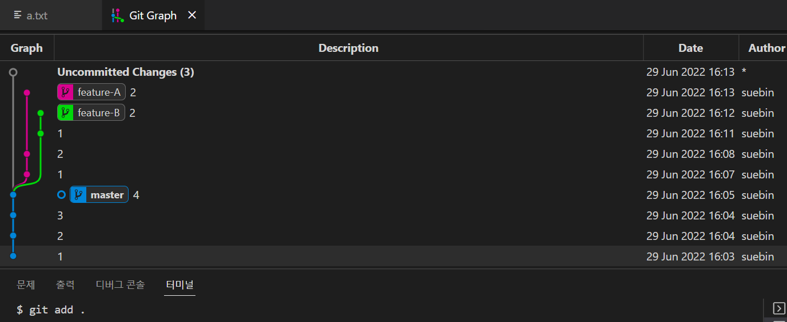

# Branch
 

- [Branch란?](#branch란?)
- [git branch](#git-branch)
- [git switch](#git-switch)
- [Branch scenario](#branch-scenario)
- [Branch Merge](#branch-merge)

  

---

## Branch란?

#### = 특정 커밋을 가리키는 ' 포인터 '

#### = 버전 관리의 꽃 🌷

 

 

- 나뭇가지처럼 여러 갈래로 작업 공간을 나누어 **독립적으로 작업**할 수 있도록 도와주는 Git의 도구
- Branch 생성 = 다른 Commit 을 바라보는 **Pointer** 를 생성하는 것
- **병렬적인 작업**

 

#### 장점

​	 ✔️ 브랜치는 독립 공간을 형성하기 때문에 원본(master)에 대해 안전하다.

​	 ✔️  하나의 작업은 하나의 브랜치로 나누어 진행되므로 체계적인 개발이 가능하다.

​	 ✔️ 특히 Git은 브랜치를 만드는 속도가 빠르고, 용량도 적게 든다.

 

#### 브랜치의 필요성

master 브랜치는 상용을 의미하므로, 언제든 세상에 공개되어 있다. 에러가 있거나 버전을 수정할 때 이미 고객들이 사용하고 있는데 함부로 master에서 수정하기가 어렵다. 따라서 별도의  작업 공간인 브랜치에서 작업을 하고, 그 내용을 master에 반영한다. 

 

 

---

## git branch

- `git branch` : 브랜치 목록 확인
- `git branch -r` : 원격 저장소의 브랜치 목록 확인
- `git branch [브랜치 이름]` : 새로운 브랜치 생성
- `git branch [브랜치 이름][커밋 ID]` : 특정 커밋 기준으로 브랜치 생성
- `git branch -d`:  병합된 브랜치만 삭제 가능

- `git branch -D <브랜치 이름>` : (주의) 강제 삭제 (병합되지 않은 브랜치도 삭제 가능)

 

 

---

## git switch

- `git switch [다른 브랜치 이름]` : 다른 브랜치로 이동
- `git switch -c [브랜치 이름]` : 브랜치 새로 생성과 동시에 이동
- `git switch -c [브랜치 이름][커밋 ID]` : 특정 커밋 기준으로 브랜치 생성과 동시에 이동

 

❗️ **git switch 하기 전에 꼭 커밋을 완료하고 이동하기** ❗️
 
master 브랜치에서 a.txt 를 만들고 git commit 하지 않은 상황에서 master 브랜치로 이동하면 a.txt 파일이 그대로 남아있다.

 

 

---

## Branch scenario

1. **사전 세팅**
   - `mkdir [폴더명]` : 홈 디렉토리에 폴더 생성
   - `cd [폴더명] `
   - `git init` : Git 저장소 생성
   - `touch a.txt` : 파일 생성 > 내용 작성  >`git add .`  >  `git commit -m ""` 
   - `git log --oneline` : 커밋한 개수만큼 master 브랜치에 버전이 만들어진 것을 확인

 

2. **브랜치 생성, 조회**
    - `git branch [브랜치 이름]` : 브랜치 생성
    - `git branch` : 브랜치 목록 확인 (*master란? : 현재 HEAD가 가리키는 브랜치는 master라는  의미)
    - `git log --oneline` : 커밋 기준으로 master와 생성한 브랜치가 위치한 것을 확인

 

3. **브랜치 이동**
   - `git switch [브랜치 이름]` :  브랜치 이동
   - `git switch -c [브랜치 이름]` : 브랜치 새로 생성과 동시에 이동
   -  `git log --oneline` : HEAD는 해당 브랜치만 가리키고, master 브랜치는 보이지 않음
   - `git log --oneline --all` : 모든 브랜치의 로그를 볼 수 있음

    

   >브랜치를 이동한다는 것은 HEAD가 해당 브랜치를 가리킨다는 것을 의미하고
   >
   >브랜치는 최신 커밋을 가리키므로,
   >
   >HEAD가 해당 브랜치의 최신 커밋을 가리키게 된다.

 

4. **이동한 브랜치에서 커밋 생성**

   - 내용 작성

   - `touch b.txt` : 파일 생성 > 내용 작성  >`git add .`  >  `git commit -m ""` 

 

 

---

# Branch Merge

독립된 작업 공간인 각 브랜치에서 작업이 끝나면 그 작업 내용을 master에 반영해야 한다.

Merge(병합)로 브랜치를 합치면 된다.

 

1. **git merge**
   - 분기된 브랜치를 하나로 합치는 명령어
   - `git merge [합칠 브랜치 이름]`
   - **Merge 하기 전에는 메인 브랜치로 switch 해야한다.**

 

2. **Merge의 종류**
    - Fast-Forword
    - 3-Way Merge
    - Merge Conflict